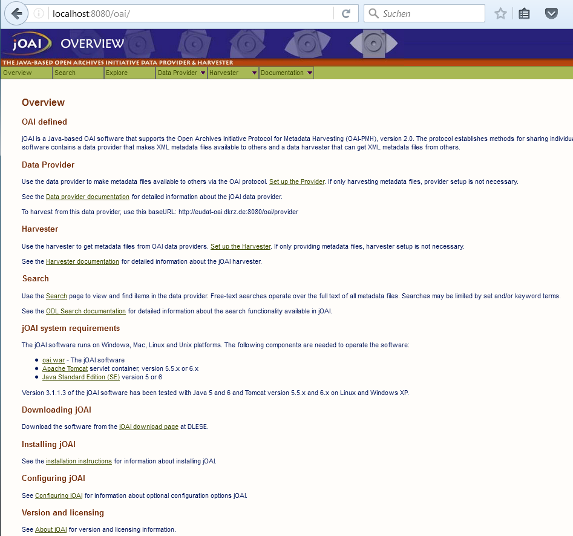

# Installation of jOAI
This document describes how to install joai software, an OAI-PMH data provider and harvester tool, taht runs within Apache Tomcat on a Ubuntu machine. 

## Environment
Ubuntu 14.04 server

## Prerequisites

### 1. Update and upgrade if necessary
```sh
sudo apt-get update
sudo apt-get upgrade
```
### 2. Internet connection and browser
If you are using a VM, e.g. setup in VirtualBox Manager, you'll need to configure the network to work in bridge mode. Furthermore an internet browser, e.g. firefox, should be installed on your computer.

##Installation

### 2. Download and unpack the jOAI Software
See http://www.dlese.org/dds/services/joai_software.jsp for details.

The current version can be downloaded from Sourceforge, e.g. as zip file

```sh
wget https://sourceforge.net/projects/dlsciences/files/jOAI%20-%20OAI%20Provider_Harvester/v3.1.1.4/joai_v3.1.1.4.zip
unzip joai_v3.1.1.4.zip
```

Note : Unzip doesn't come by default with Ubuntu server 14.04., but could easily installed by
```sh
sudo apt-get install unzip
```

### 3. Install tomcat
In the INSTALL.txt of the joi package above it is recommended to download
the Tomcat server container from http://tomcat.apache.org/ .
But in most cases (and in case of Ubuntu version 12 and greater) you can use the pre-installed Tomcat package.  
The current version of tomcat is 7, but joai runs as well within tomcat6.
```sh
sudo apt-get install tomcat7
```

#### 3a. Tomcat trouble shooting
One known problem with tomcat is, that there are conflicts with other web server, e.g. an apache, running on the same machine.

For general 'trubleshooting and Diagnostic techniques' we refer to
```sh https://wiki.apache.org/tomcat/FAQ/Troubleshooting_and_Diagnostics ```
<!-- ??
or ask for support at EUDAT help desk ...??? 
-->

### 4. Add the web application jOAI to the Tomcat container
Place the file 'oai.war' into the 'webapps' directory found in your Tomcat installation directory. 'webapps' is the default location where Tomcat 
expects to find web applications.
```sh
sudo cp joai_v3.1.1.4/oai.war /var/lib/tomcat7/webapps/
```
During the first start tomcat will unpack the application 'oai'.

### 5. Install Java Platform, Standard Edition v5 or later
Tomcat needs the Java Run Time environment (JRE).
Often this is already preinstalled on ubuntu by apt-get update.

You can check the instalation (path) e.g. by 
```sh
readlink -f $(which java)
``` 
If java isn't installed, install at least JRE :
```sh
sudo apt-get install default-jdk
```

Finally set the environment variable JRE_HOME, e.g. 
```sh
JRE_HOME=/usr/lib/jvm/java-7-openjdk-amd64/jre/bin/java
```
in your ```sh ~/.bashrc```

## 6. Start Tomcat 

Try to start tomcat by
```sh
sudo service tomcat7 start
```

If you now enter in an internet browser
```sh
localhost:8080
```
and all woks fine you should see a page showing **'It works'** and the graphical user interface of the web application joi should be opened by 
```sh
localhost:8080/oai
```



Congratultaions !

Now you can configure and use your OAI-PMH provider and harvester
as described in 01-configure-your-OAI-server

## 7. Repository configuration
You should do some basic configurations at the beginning.

In the entry page `Overview` click under `Data Provider` on `Set up the Provider`. On the then opened page `Data Provider Documentation` you will find a lot of information we will need in teh next modul. 

For now we click under `Data Provider setup` on `Repository information`. Here you can add information describing your repository. (Allways use the questionmark buttons to get more detailed inforamtion about the fields).


