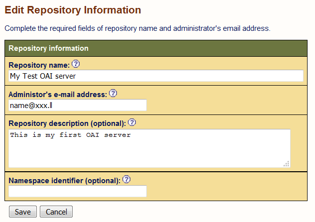

# Installing an OAI server
This document describes how to install and set up a full implementation of an Open Archives Initiative (OAI) server based on the open source software *jOAI*. An OAI server can be used to provide metadata records via OAI Protocol for Metadata Harvesting (OAI-PMH). It can also be used to a harvest metadata from OAI-PMH endpoints.

In the next two modules, [02.a](../master/02.a-OAI-data_provider.md) and [02.b](../master/02.b-OAI-harvester.md), we will explain how to configure the OAI-PMH data provider and harvester tool  repectively, based on this software. In our examples, jOAI will run within Apache Tomcat on an Ubuntu machine.

## Environment
Ubuntu 14.04 server

## Prerequisites

### 1. Update and upgrade if necessary
```sh
sudo apt-get update
sudo apt-get upgrade
```

### 2. Internet connection and browser

In general, an internet browser, e.g. Firefox, should be installed on your computer.
If you are using a VM, e.g. in VirtualBox Manager, you will need to configure the network to work in bridge mode. 

If you are using a VM in a cloud environment, you might need to configure the firewall. Below we demonstrate setting up an example firewall using iptables-persistent. If you are using a different firewall configuration tool, it is important that port 80 and port 8080 are open for use (also port 8181 in most cases, see the [next section](#3a-tomcat-troubleshooting)).
- Install iptables-persistent

```sh
sudo apt-get install iptables-persistent
```

- Edit /etc/iptables/rules.v4:
```sh
*filter
:INPUT ACCEPT [0:0]
:FORWARD ACCEPT [0:0]
:OUTPUT ACCEPT [4538:480396]
-A INPUT -m state --state INVALID -j DROP
-A INPUT -p tcp -m tcp ! --tcp-flags FIN,SYN,RST,ACK SYN -m state --state NEW -j DROP
-A INPUT -f -j DROP
-A INPUT -p tcp -m tcp --tcp-flags FIN,SYN,RST,PSH,ACK,URG NONE -j DROP
-A INPUT -p tcp -m tcp --tcp-flags FIN,SYN,RST,PSH,ACK,URG FIN,SYN,RST,PSH,ACK,URG -j DROP
-A INPUT -p icmp -m limit --limit 5/sec -j ACCEPT
-A INPUT -m state --state RELATED,ESTABLISHED -j ACCEPT
-A INPUT -p tcp -m tcp --dport 22 -j ACCEPT
-A INPUT -p tcp -m tcp --dport 80 -j ACCEPT
-A INPUT -p tcp -m tcp --dport 8080 -j ACCEPT
-A INPUT -p tcp -m tcp --dport 8181 -j ACCEPT
-A INPUT -p tcp -m tcp --dport 8983 -j ACCEPT
-A INPUT -p tcp -m tcp --dport 5432 -j ACCEPT
-A INPUT -j LOG
-A INPUT -j DROP
COMMIT
```

- Restart the firewall
```sh
/etc/init.d/iptables-persistent restart
```

### Installation

### 2. Download and unpack the jOAI Software
See [this page](http://www.dlese.org/dds/services/joai_software.jsp) for details about jOAI.

The current version can be downloaded from Sourceforge as zip file:

```sh
wget https://sourceforge.net/projects/dlsciences/files/jOAI%20-%20OAI%20Provider_Harvester/v3.1.1.4/joai_v3.1.1.4.zip
unzip joai_v3.1.1.4.zip
```

Note, unzip does not come by default with an Ubuntu server 14.04, you can install it with:
```sh
sudo apt-get install unzip
```

### 3. Install Tomcat
In the INSTALL.txt of the jOAI package above, it is recommended to download
the Tomcat server container from [the official Tomcat webpage](http://tomcat.apache.org/).
However, in most cases (and in case of Ubuntu version 12 and greater), you can use the pre-installed Tomcat package.  
The current version of tomcat is 7, but jOAI also runs within tomcat6, if that is what is on your system.
```sh
sudo apt-get install tomcat7
```

#### 3a. Tomcat troubleshooting
One known problem with Tomcat is that there are conflicts with other web servers, e.g. Apache, running on the same machine.
If you want run a CKAN instance in parallel, for instance, you must change the port of the connector in the file ```/etc/tomcat7/server.xml``` :
```sh
   <!-- Changed port 8080 to 8181 -->
    <Connector port="8181" protocol="HTTP/1.1"
               connectionTimeout="20000"
               URIEncoding="UTF-8"
               redirectPort="8443" />
```    
Then restart Tomcat by
```
sudo service tomcat7 restart
```
Hence, jOAI will run on:
```
http://localhost:8181/,
```
or if you work on a remote server (VM):
```
http://<ip-address or fully qualified domain name>:8181/
```

We will deploy CKAN, which makes use of apache, so we advise you to use port 8181, the firewall has also been set up accordingly in [section 2](#2-internet-connection-and-browser)).

For general **troubleshooting and Diagnostic techniques**, refer to the [Apache Tomcat troubleshooting page](https://wiki.apache.org/tomcat/FAQ/Troubleshooting_and_Diagnostics).

### 4. Add the web application jOAI to the Tomcat container
Place the file *oai.war* into the *webapps* directory found in your Tomcat installation directory. The *webapps* directory is the default location where Tomcat searches for web applications:
```sh
sudo cp joai_v3.1.1.4/oai.war /var/lib/tomcat7/webapps/
```

During its first start, Tomcat will unpack the application *oai*.

### 5. Install the Java Platform, Standard Edition v5 or later
Tomcat needs the Java Runtime environment (JRE).
Often, this is already preinstalled on ubuntu by an apt-get update.

You can check the installation (path) by: 
```sh
readlink -f $(which java)
``` 
If java is not installed, at least install JRE:
```sh
sudo apt-get install default-jdk
```
or for the latest java version execute:
```sh
sudo apt-get install oracle-java8-installer.
```

Finally set the environment variable JRE_HOME, e.g. 
```sh
JRE_HOME=/usr/lib/jvm/java-7-openjdk-amd64/jre/bin/java
```
or 

```sh
JRE_HOME=/usr/lib/jvm/java-8-oracle/jre/bin/java
```
in your ```sh ~/.bashrc```.

### 6. Start Tomcat 

Try to start Tomcat using:
```sh
sudo service tomcat7 start
```

To stop, start, or restart Tomcat you can use the follwing command:
```sh
sudo service tomcat7 <stop, start, restart>
```

Now, if you are working on the current machine, try the following in an internet browser:
```sh
<localhost>:8181
```
If you are working on a remote server (VM), try:
```
<ip address or fully qualified domain name>:8181
```
If all works fine, you should see a page with the title **'It works!'**, and the graphical user interface of the web application jOAI should be opened by: 
```sh
localhost:8181/oai
```
or
```sh
http://<ip-address or fully qualified domain name>:8181/oai/
```


Congratultaions!

**Note**, when running tomcat for the first time after a configuration change, the loading of the webpage can take very long.

Now you can configure and use your OAI-PMH provider and harvester
as described in the following module, [02.a-Configuring an OAI Data Provider](../master/02.a-OAI-data_provider.md).

### 7. Repository configuration
First, some basic configurations should be set.
On the *Overview* page, by clicking on the link **Set up the Provider**, you will be lead to the *Data Provider Documentation* page, where you can find lots of information that will be needed in the next module. 

For now, click on the **Repository information** link. By clicking on the **Edit repository info** button on this page, you will be lead to a page similar to the image below, where information describing your repository can be added.



This page can also be accessed through the menus, following **Data Provider**, and then **Repository Information and Administration**.

> Note: For now we will not specify the optional `Namespace identifier`.

### 8. (Optional) Repository security
After this installation, anyone can access all ionformation on the server. To restrict access to sensitive data, such as harvesting information, follow the instructions on [this page](https://uc.dls.ucar.edu/joai/docs/configuring_joai.jsp#accessControl).
This is optional and not required for this tutorial. However we strongly recommend to restrict access on a production system .

## Centos Install
Here we briefly desctribe how to set up an OAI server on a centos machine.

### 1. Set hostname and firewall
```sh
sudo hostnamectl set-hostname b2find
sudo iptables -A INPUT -p tcp -m tcp --dport 8080 -j ACCEPT
sudo iptables -A INPUT -p tcp -m tcp --dport 8181 -j ACCEPT
```
Make sure there is no `-A INPUT -j DROP` before the upper two lines. You can delete and add the 'DROP' like this:
```sh
sudo iptables -L --line-numbers
sudo iptables -D INPUT <Line number with DROP>
sudo iptables -A INPUT -j DROP
```
Finally save the firewall configuration:
```sh
sudo service iptables save
```

### 2. Install Java dependencies and Tomcat
```sh
sudo yum install jre
sudo yum install tomcat
sudo yum install tomcat-webapps tomcat-admin-webapps
```
Start Tomcat:
```sh
sudo systemctl -l restart tomcat
```
To check whether Tomcat runs open a webbrowser and go to `http://<FQDN or IP or localhost>:8080`. You should see the Tomcat welcome page.

### 3. Redirect Tomcat to port 8181
To avoid clashes with the CKAN server which we will install later redirect Tomcat to port 8181.
```
sudo cp /etc/tomcat/server.xml /etc/tomcat/server.xml_orig
sudo vi /etc/tomcat/server.xml
```
And edit 

```sh
   <!-- Changed port 8080 to 8181 -->
    <Connector port="8181" protocol="HTTP/1.1"
               connectionTimeout="20000"
               URIEncoding="UTF-8"
               redirectPort="8443" />
```    
Finally restart Tomcat and check landing page with the new port:
```
sudo service tomcat restart
```

### Install JOAI
```
sudo yum install unzip
wget https://sourceforge.net/projects/dlsciences/files/jOAI%20-%20OAI%20Provider_Harvester/v3.1.1.4/joai_v3.1.1.4.zip
unzip joai_v3.1.1.4.zip
sudo cp joai_v3.1.1.4/oai.war /var/lib/tomcat/webapps/
sudo service tomcat restart
```
Now go to `http://<FQDN or IP or localhost>:8181/oai` and check whether you find the OAI-PMH server landing page.


