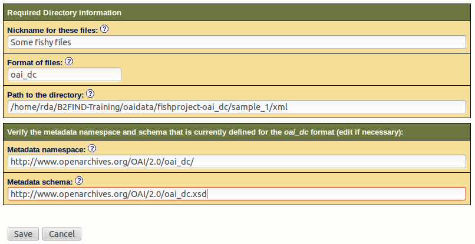
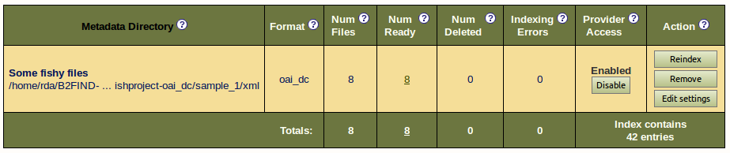
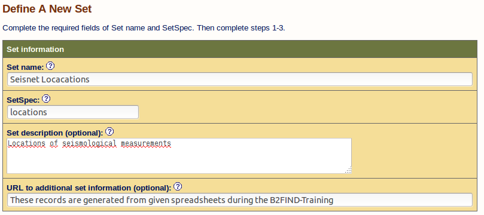
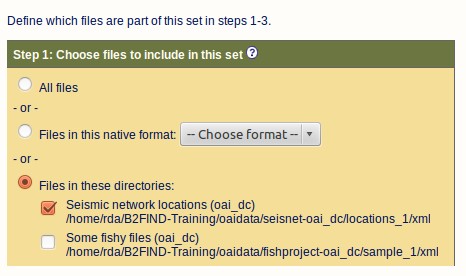
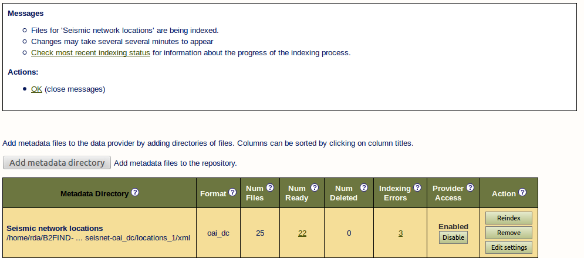
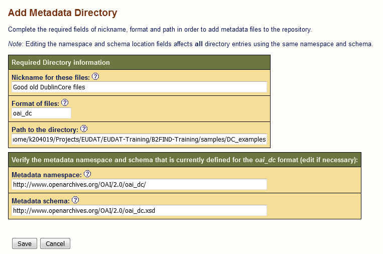

# Configuration of an OAI Data Provider
This document describes how to configure your own OAI-PMH data provider based on a 
jOAI installation. 

##Prerequisites
<<<<<<< HEAD
1. [Installation of the jOAI software](02-install-jOAI.md) running in an Apache Tomcat. In the following we assume that the OAI server is running and accessible at `http://<fqdn or ip>/oai`, whereby <fqdn or ip> is the ip-address or fully qualified domain name of your OAI server.
2. Admin account : If you start the first time the `Data Provider` setup you are prompted to login as user *admin*. By default the password is set as well to *admin*. Furthermore you can restrict access to your server or to parts of the stored data as described in section [Repository security](02-install-jOAI.md#reposSecurity) 
3. XML files in OAI metadata format : If you followed the module [01 Generate metadata](01.b-generate-metadata.md) at least for the project *fishproject* should be some DublinCore XML files available. Furthermore we provide you with some example files in the correct format in sub directories of `samples/DC_examples/`.

## Configuration and Customization
How XML files can be indexed for harvesting is here explained with the generated DublinCore XML files for the *fishproject*(see [01. Generation of metadata](01.b-generate-metadata.md)). But of course it works with any other XML files, as far they are formatted in a valid metadata schema.

### Add XML records to a metadata directory

Open the GUI of joai at `http://<fqdn or ip>/oai` and go to `Data Provider` and `Metadata Files Configuration` and fill out the text fields:



* Nickname for these files : Just a label, that describes the content of your metadata ...
* Format of files : The metadata format for the files. We choose `oai_dc`, the OAI abbrevation for *Dublin Core*.
* Path to the directory : Please choose the path to the XML files which should be indexed for harvesting in your OAI provider. 
 * Metadata schema: The URL of the associated MD schema (thsi is automatically filled out, because `oai_dc` is a by OAI supported metadata format.

If you press `Save` and afterwards `Index` you get as result :



## Checks
You can check your data provider and the entries you offer for harvesting here:
http://\<ip address, fully qualified domain name or localhost\>:8181/oai/provider?verb=ListIdentifiers&metadataPrefix=oai_dc

### Add a new set

To group metadata records together and distinguish them from other sets, you can add a set to your OAI provider. For this click under the menue `Data provider` on `Sets Configuration` and there on `Define a new set`. We illustrate this here with the example project `seisnet` (see [Excercise1](#Excercise1)), for which we add an OAI-subset `locations`. But feel free to define a subset for the `fishproject`.



* Nickname for these files : Just a label, that describes the content of your metadata ...
* Set name : A descriptive name for a group of metadata files taht are a subgroup of all metadata files in the repository.
* SetSPec: A short name or label that identifies the subgroup of metadata records, harvesters may use for selective harvesting.
* Set description (optional) : Narrative taht describes the subgroup in more detail.

Furthermore you can in the next steps define which files should be part of this set. We restrict the set to all files of the project `seisnet` :



If you press `Save` you get as result :


#### <a name="Excercise1"></a> Excercise 1
Add a metadata directory for the XML files of the project *seisnet*. (If you succesfully generated the associated XML files in [01.b Generate MD for seisnet](01.b-generate-metadata.md#Excercise2.3) the XML files reside in `oaidata/seisnet-oai_dc/locations_1/xml/`. If not, you can as well the files in `samples/DC_examples/seisnet/xml` already coming with the training material.

In the following figure its examplary shown shown how the fields should be filled out :


In our case this leads to only partly successfully indexed files :  


## Validation
If some of the XML records could not be validated this is assigned in the column 'Indexing failed', as shown above for the project *seisnet*, see [Excercise 1](#Excercise1). 

You can now click on the number of the faulty records and then on 'Validate XML record'. But in most cases the error messages are quiet sparse.

You get more detailed information if you check your XML files by a XML validator as e.g. `http://www.xmlvalidation.com`.

#### <a name="Excercise2"></a> Excercise 2
Validate the errornous files and try to find out and correct the bugs.
=======
1. Installation of the jOAI software running in an Apache Tomcat.
See 02-install-jOAI.md for details.
2. Admin account
If you start the provider setup you are prompted to login as user *admin*. By default the password is set as well to *admin*.
<!-- Is this true ??
Describe how to change the password !!!
--> 

3. XML files in OAI metadata format
We provide you with some example files in the correct format under this git repository in 
```sh 
samples/DC_examples/ 
```
You can also use the DublinCore XML files you generated in [Module 01](https://github.com/EUDAT-Training/B2FIND-Training/blob/master/01.b-generate-metadata.md).


## Configuration and Customization
Open the GUI of joai at ```http://<fqdn or ip>/oai ``` and go to `Data Provider` and `Metadata Files Configuration` and fill out the text fields:



* Nickname for these files : Just a label, that describes the content of your metadata ...
* Format of files : The metadata format for the files, e.g. `oai_dc` for *Dublin Core Format*
* Path to the directory : Location of the XML files
* Metadata schema: The URL of the associated MD schema (is automatically filled out, if a known OAI metadata format is specified as e.g. `oai_dc`

## Checks
You can check your data provider and the entries you offer for harvesting here:
http://<ip address, fully qualified domain name or localhost>:8081/oai/provider?verb=ListIdentifiers&metadataPrefix=oai_dc

>>>>>>> master
