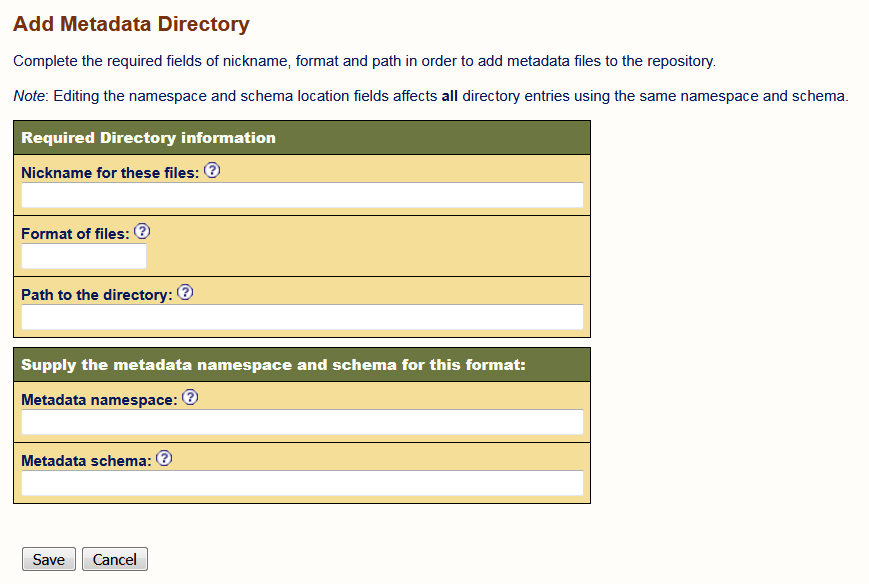

# Configuration of an OAI Data Provider
This document describes how to configure your own OAI-PMH data provider based on a 
jOAI installation. 

##Prerequisites
1. Installation of the jOAI software running in an Apache Tomcat.
See 02-install-jOAI.md for details.
2. Admin account
If you start the provider setup you are prompted to login as user *admin*. By default the password is set as well to *admin*.
<!-- Is this true ??
Describe how to change the password !!!
--> 

3. XML files in OAI metadata format
We provide you with some example files in the correct format under this git repository in 
```sh 
samples/DC_examples/ 
```
You can also use the DublinCore XML files you generated in [Module 01](https://github.com/EUDAT-Training/B2FIND-Training/blob/master/01.b-generate-metadata.md).


## Configuration and Customization
Open the GUI of joai at ```http://<fqdn or ip>/oai ``` and go to `Data Provider` and `Metadata Files Configuration` and fill out the text fields:



* Nickname for these files : Just a label, that describes the content of your metadata ...
* Format of files : The metadata format for the files, e.g. `oai_dc` for *Dublin Core Format*
* Path to the directory : Location of the XML files
* Metadata schema: The URL of the associated MD schema (is automatically filled out, if a known OAI metadata format is specified as e.g. `oai_dc`

## Checks
You can check your data provider and the entries you offer for harvesting here:
http://<ip address, fully qualified domain name or localhost>:8081/oai/provider?verb=ListIdentifiers&metadataPrefix=oai_dc

