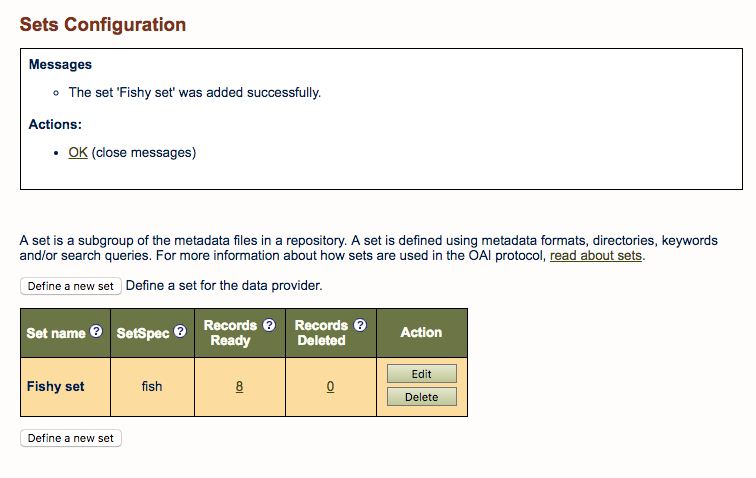
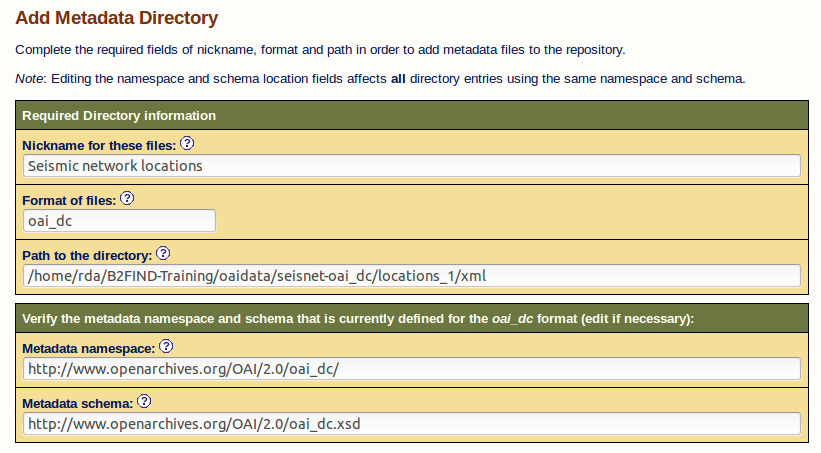

# Configuring an OAI Data Provider
This document describes how to configure your own OAI-PMH data provider based on a 
jOAI installation. 

## Prerequisites

1. [Installation of the jOAI software](02-install-jOAI.md) running on Apache Tomcat. In the following, we assume that the OAI server is running and accessible at `http://<fqdn or ip>/oai`, where `<fqdn or ip>` is the  IP address or fully qualified domain name of your OAI server.
2. Admin account: The first time you start the `Data Provider` setup, you are prompted to login as user *admin*. By default the password is set as well to *admin*. Furthermore, you can restrict access to your server or to parts of the stored data as described in section [Repository security](02-install-jOAI.md#8-optional-repository-security).
3. XML files in OAI metadata format: If you followed the module [01 Generate metadata](01.b-generate-metadata.md), you should have some DublinCore XML files, at least for the *fishproject* project. In addition to those, we provide you with some example files in the correct format in subdirectories of `samples/DC_examples/`.

## Configuration and Customization
We will explain how XML files can be indexed for harvesting using the DublinCore XML files generated for the *fishproject* (see [01. Generation of metadata](01.b-generate-metadata.md)). The same method should generally work with any other XML files, as long they are formatted in a valid metadata schema.

### Add XML records to a metadata directory

Open the GUI of jOAI at `http://<fqdn or ip>/oai` and go to `Data Provider` and then `Metadata Files Configuration`, click on the `Add Metadata Directory` button and fill out the text fields:

* Nickname for these files : This is just a label; something that describes the content of your metadata.
* Format of files: The metadata format for the files. We choose `oai_dc`, the OAI abbrevation for *Dublin Core*.
* Path to the directory: Please choose the path to the XML files which should be indexed for harvesting in your OAI provider. 
* Metadata namespace and metadata schema: The URL of the associated metadata schema (this is automatically filled out, because the `oai_dc` format is supported by OAI.

If you press `Save` and `Reindex all files` the records will be saved and indexed, and you will have, as a result:

#### Checks
You can check your data provider and the entries you offer for harvesting here:
`http://<ip address, fully qualified domain name or localhost>:8181/oai/provider?verb=ListIdentifiers&metadataPrefix=oai_dc`

### Add a new set

To group metadata records together and distinguish them from other sets, you can add a set to your OAI provider. For this click under the menue `Data provider` on `Sets Configuration` and there on `Define a new set`. We will add an OAI-subset `fish` for our previous metadata from the `fishproject` as an example.

* Set name : A descriptive name for a group of metadata files taht are a subgroup of all metadata files in the repository.
* SetSPec: A short name or label that identifies the subgroup of metadata records, harvesters may use for selective harvesting.
* Set description (optional) : Narrative taht describes the subgroup in more detail.

Furthermore you can in the next steps define which files should be part of this set. We restrict the set to all files of the project `seisnet` :

If you press `Save` you get as result :

#### Excercise 1
Add a metadata directory for the XML files of the project *seisnet*. (If you succesfully generated the associated XML files in [01.b Generate MD for seisnet](01.b-generate-metadata.md#Excercise2.3) the XML files reside in `oaidata/seisnet-oai_dc/locations_1/xml/`. If not, you can as well the files in `samples/DC_examples/seisnet/xml` already coming with the training material.

In the following figure its examplary shown shown how the fields should be filled out :

In our case this leads to only partly successfully indexed files :  

## Validation
If some of the XML records could not be validated this is assigned in the column 'Indexing failed', as shown above for the project *seisnet*, see [Excercise 1](#excercise-1). 

You can now click on the number of the faulty records and then on 'Validate XML record'. But in most cases the error messages are quiet sparse.

You get more detailed information if you check your XML files by a XML validator as e.g. `http://www.xmlvalidation.com`.

#### Excercise 2
Validate the errornous files and try to find out and correct the bugs.

