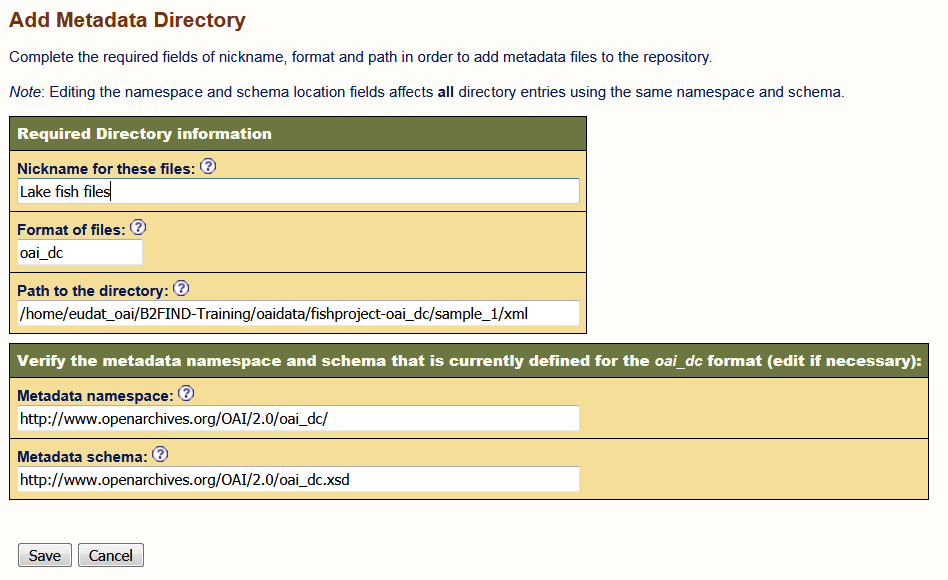

# Configuration of an OAI Data Provider
This document describes how to configure your own OAI-PMH data provider based on a jOAI installation. 

## Environment
Ubuntu 14.04 server

##Prerequisites
### 1. Installation of the jOAI software running in an Apache Tomcat.
See [02-install-jOAI.md](02-install-jOAI.md) for details.
### 2. Admin account
If you start the provider setup you are prompted to login as user *admin*. By default the password is set as well to *admin*.
<!-- Is this true ??
Describe how to change the password !!!
--> 

### 3. XML files in OAI metadata format
We provide you with some example files in the correct format under this git repository in 
```sh 
samples/DC_examples/ 
```

But you can use as well the DublinCore XML files you have generated in modul 01.


## Configuration

### 1. Configuration and custumization
Open the GUI of joai at ```http://localhost/oai``` and go in the menu `Data Provider` to `Metadata Files Configuration`.

#### Add a metadata directory
By clicking on ```Add metadata directory``` a page opens, 


where you have to fill in the *Required Directory information* :
* Nickname for these files : Just a label, that describes the content of your metadata. 
* Format of files : The metadata format for the files, e.g. ```oai_dc``` for *Dublin Core Format*
* Path to the directory : Location of the XML files, e.g. the paths to the generated XML files for the *fishproject* as described in the module [01.b-generate-metadata.md](01.b-generate-metadata.md). 
and optionally specification of the metadata namespace and schema :
* Meatdata namespace: An XML label, written as a web address, which is used to distinguish and identify where markup has come from. In general this can be found near the top of an XML instance document for the given format. If the format is recognized by the software this field will be filled in automatically.
* Metadata schema: The URL of the associated MD schema (is automatically filled out, if a known OAI metadata format is specified as e.g. `oai_dc`)

For the *fishproject* this may be looka as :


 
Clicking on ```Save``` should result in a new metadata directory listed as :


You can see that there are eight files in the new metadata directory (column *Num files*).
In order to make tehm available they must first get *indexed*. For thsi click please the button ```Reindex``` in the right column ```Action```. If all works fine, eight files are indicated as indexed (see column ```Num Ready```) as shown in the following figure.


#### Create and assign an OAI set 
  
