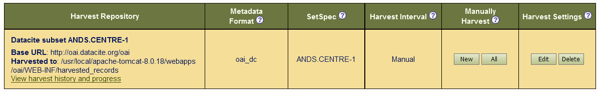

# Configuring an OAI harvester
This document describes how to configure your own OAI-PMH harvester based on a jOAI installation.
We will take you through the steps of how to harvest the *OAI endpoint* of an existing repository.

## Prerequisites
1. [Installation of the jOAI software](02-install-jOAI.md) running on Apache Tomcat. In the following, we assume that the OAI server is running and accessible at `http://<fqdn or ip>/oai`, where `<fqdn or ip>` is the ip-address or fully qualified domain name of your OAI server.
2. Admin account:  If you start the `Harvester` setup for the first time, you may be prompted to login as user *admin*. The password for this account is, by default, also set to *admin*. Furthermore, you can restrict access to your server or to parts of the stored data, as described in section [Repository security](02-install-jOAI.md#8-optional-repository-security).
3. XML files provided in the OAI provider, see previous module [2.a Configuring an OAI Data Provider](02.a-OAI-data_provider.md). We assume that some files are available for harvesting, at least the DublinCore XML records for the project *fishproject* should be available.
4. (Optional) The script [`mdmanger.py`](mdmanager.py). If you want to harvest from the command line, you can use the python script - whose usage is described in detail in [`The mdmanager.py script`](00-mdmanager-script.md) - in processing mode `--mode h`. 

## Configuration and customization
In this section we explain how XML files can be harvested using the DublinCore XML files of the *fishproject* (see [02.a Providing metadata](02.a-OAI-data_provider.md)) as an example. The instructions here should work with any other XML files, as long as they are accessable to the OAI data provider, as we shall see in the excercises.

### Adding a new Harvester

Open the GUI of the jOAI at `http://<fqdn or ip>/oai`. In the `Harvester` sub-menu of the main menu, you will find the `Setup and Status` option. Click on this, and then on the `Add new harvest` button in the resulting page. The form that shows up is used to set up a harvester. 


Now we need to provide information on the repository we would like to harvest. 
In the following table, we provide the settings for our usecases `fishproject` and `seisnet`, as well for two external repositories, namely the *GFZ* (Geo Forschungszentrum Potsdam) and *DataCite*:

<table>
  <tr>
    <th>OAI Parameters</th>
    <th colspan="4">Examples</th>
  </tr>
  <tr>
    <th>Parameter</th>
    <th>Fish Project</th>
    <th>Seisnet Project </th>
    <th>GFZ</th>
    <th>DataCite</th>
  </tr>
  <tr>
    <td>Project Name</td>
    <td><code>fishproject</code></td>
    <td><code>seisnet</code></td>
    <td><code>gfz</code></td>
    <td><code>datacite</code></td>
  </tr>
  <tr>
    <td>OAI-Repository name</td>
    <td>Fish project Repos </td>
    <td>Seismic Network Repos</td>
    <td>GFZ Repos</td>
    <td>DataVite Archive </td>
  </tr>
  <tr>
    <td>OAI-URL</td>
    <td colspan = "2"><code>http://&ltfqdn or ip&gt/oai/provider</code></td>
    <td><code>http://doidb.wdc-terra.org/oaip/oai</code></td>
    <td><code>http://oai.datacite.org/oai</code></td>
  </tr>
  <tr>
    <td>OAI subset</td>
    <td><code>mdsubset</code></td>
    <td><code>locations</code></td>
    <td><code>DOIDB.SEISNET</code></td>
    <td><code>ANDS.CENTRE-1</code></td>
  </tr>
  <tr>
    <td>OAI verb</td>
    <td><code>verb</code></td>
    <td colspan = "3"><code>ListIdentifiers</code> or <code>ListRecords</code></td>
  </tr>
  <tr>
    <td>OAI MD format</td>
    <td><code>mdprefix</code></td>
    <td><code>oai_dc</code></td>
    <td colspan = "2"><code>oai_dc</code> or <code>oai_dublincore</code></td>
  </tr>
</table>

Some of the above settings are optional or can be set in different ways.
Just play around with it.
However, note that when harvesting from DataCite, the subset field must definitely be used (i.e. parameter `mdsubset` rsp. `set`), because the full extent of metadata provided on DataCite will be too large for testing purposes.

For the `fishproject`, the settings can look like this: 


Note that `/provider` must be appended to the homepage to obtain the *provider* URL.

We set the 'default harvest location' to the path `/home/rda/B2FIND-Training/oaidata/fishproject-oai_dc/SET_1/xml`. This directory will also be accessed for the processing in the following training chapters,  [03.](03.a-map-metadata.md) and [04.](04-install-CKAN.md). This directory should be created beforehand and made readable for all:
```sh
$ mkdir oaidata/fishproject-oai_dc/SET_1/xml
$ chmod o+w oaidata/fishproject-oai_dc/SET_1/xml
```

If you confirm the settings by clicking on the `Save` button, the successful configuration will result in a new `Harvest Repository`:


### Harvesting from an OAI provider
There are three ways to harvest from an OAI repository:
- Via the JOAI GUI by choosing one of the *Manual Harvest* options of your *Harvester Repository* in the *Harvester Setup and Status* page.
- Submit the OAI harvest requests via your browser's address bar.
- Harvest from the command line by using the `mdmanager.py` script.

Each of these methods is illustrated below with the `fishproject` example. Feel free to try it out with other settings and other OAI repositories (see the excercices below).

#### Using the jOAI GUI
To trigger the harvesting using the GUI, it suffices to click on the *All* button in the *Manually Harvest* column of the `Fish Project Repository` created above. If you do so, you will get asked to confirm that previous files can be deleted:


By clicking on *ok*, the harvest request will be submitted. Now if you press *View harvest history and progress* button on the top of the page to monitor the progress, you may see:


In this case you can see that the last attempt was successful completed, but the one before it was not, due to missing write permissions of the output directory. This was resolved by ecxecuting the `chmod` command, as explained above.

Now, check the content of this directory and compare one of the provided files with its harvested counterpart:
```sh
$ ls oaidata/fishproject-oai_dc/SET_1/xml
-rw-rw-rw-. 1 k204019 k204019 718  8. Sep 11:05 Compressiceps-DC.xml
-rw-rw-rw-. 1 k204019 k204019 718  8. Dez 13:17 Compressiceps.xml
.........
$ $ diff -w oaidata/fishproject-oai_dc/SET_1/xml/Compressiceps.xml oaidata/fishproject-oai_dc/sample_1/xml/Compressiceps.xml
``` 
The files should be the same, save for differences in white spaces.


#### Using an internet browser

The second method for performing harvesting requests is by entering HTTP requests in the address bar of your internet browser. First we try to identify the OAI-URL by setting the OAI-verb to `Identify`. The format for using this verb is `http://<fqdn or ip>/oai/provider?verb=Identify`, as we can see in the image bellow:


ُThere are several 'OAI-verbs' that you can experiment with. See, for instance, [the OAI-PMH list](http://www.openarchives.org/OAI/openarchivesprotocol.html#ProtocolMessages). 
Some verbs that are useful for our fish example are listed in the following table.
    
|OAI verb 		| Description 			  	| Examplary result|
|---------		|-------------			  	|-----------------|
| Identify 		| Returns available information about the OAI provider 	| see figure above |
| ListSets 		| Lists the defined OAI sets 	  	| e.g. the set `locations` with description of its content |
| ListMetadataFormats 	| Lists all used metadata formats 	| e.g. `oai_dc`, the abbrevation for the DublinCore schema |
| ListIdentifiers 	| Lists all headers of available records| e.g. the identifiers belonging to the `seisnet` project  |
| ListRecords 		| Lists all availabel records 	  	| e.g. the records belonging to the `seisnet` project  |
 
> Note: The verbs `ListIdentifiers` and `ListRecords` require the `metadataPrefix` to be specified. This is the metadata schema that is specified above by the parameter `mdPrefix`.

#### Using the command line interface
You can use the python script `mdmanager.py` in the `h` mode to harvest directly from the command line.

For this part, we will specify a source file using the `-s SOURCE` option and use the `verb` parameter from the *Harvest Options*:

```sh
These options will be required to harvest metadata records from a data
provider (by default via OAI-PMH from the URL given by SOURCE).

--verb=STRING           Verbs or requests defining the mode of harvesting, can
                        be ListRecords(default) or ListIdentifers if OAI-PMH
                        used or e.g. 'works' if JSON-API is used
--fromdate=DATE         (Optional) Filter harvested files by date (Format: YYYY-MM-DD).
```

The corresponding command for the `fishproject` would be:


```sh
./mdmanager.py --mode h -c fishproject --source  http://localhsot:8181/oai/provider
....

```
 
You can also set the `OAI request` in the file `harvest_list` (as provided in this git-repository) by adding a line with the following entries
```sh
ishproject http://localhost:8181/oai/provider ListIdentifiers oai_dc
```
If you do so, you can also skip the `SOURCE` option and just submit:
```sh
./mdmanager.py --mode h -c fishproject
```
which should yield in the same output. 
The harvested records are written to the same directory as above, but now the XML files are renamed by unique id numbers.

### A Few Excercises

#### <a name="Excercise1"></a> Excercise 1
If you already made some records available for the `seisnet` project in the previous module, you can now set up a harvester for these records.  In this case, set the optioanal parameter `SetSpec` to `locations`.

#### <a name="Excercise2"></a> Excercise 2 
Add another `harvester` for harvesting from a subset of the DataCite repository. Set the parameters as specified in the table above and make sure to set the optional parameter `SetSpec` to `ANDS.CENTRE-1`. This configuration should result in a new `Harvest Repository` as shown in the following figure :



```sh
./mdmanager.py --mode h -c datacite --source  http://oai.datacite.org/oai \
	--verb ListRecords --mdprefix oai_dc --mdsubset ANDS.CENTRE-1
```
 
Again you can set the paramters in the configuration file `harvest_lsit`, i.e. add a line:
```sh
datacite  http://oai.datacite.org/oai  ListIdentifiers  oai_dc ANDS.CENTRE-1
```
and just submit 
```sh
./mdmanager.py --mode h -c datacite --mdsubset ANDS.CENTRE-1
Version:  	2.0
Run mode:   	Harvesting
Start : 	2016-10-31 16:12:09


|- Harvesting started : 2016-10-31 16:12:09
	|- Iterate through 39 records in 0 sec
	[==                  ]     4 ( 10%) in 0 sec
	[====                ]     8 ( 20%) in 0 sec
	[======              ]    12 ( 30%) in 1 sec
	[====================]    39 (100%) in 4 sec
```

The harvested records will be written to the corresponding directory:

```sh
ls oaidata/datacite-oai_dc/ANDS.CENTRE-1/xml/
11dff0d6-da94-55de-a5b5-0fdf3cf921d5.xml  92cd9237-ad3d-503e-8750-5ee326e48d9b.xml
12a32c33-02ed-5e31-8f59-2cb28c222555.xml  9323ab8c-94ad-5efe-9427-579ce3dd28ae.xml
...........
```

