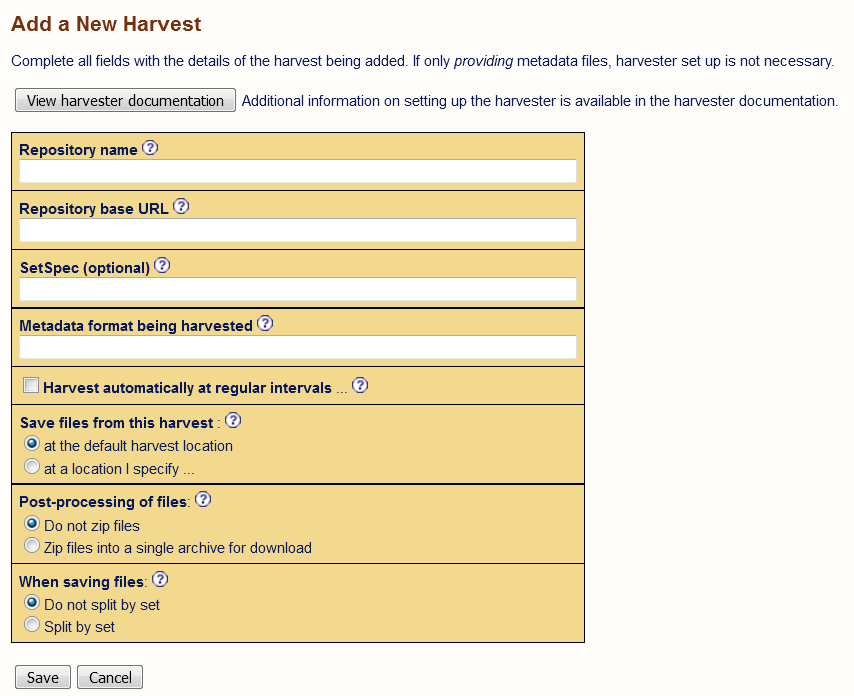
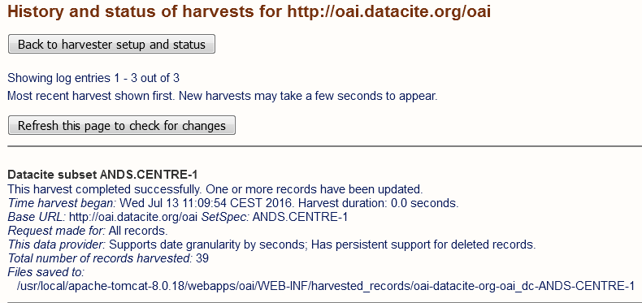

# Configuring an OAI harvester
This document describes how to configure your own OAI-PMH harvester based on a joai installation.
We will take you through the steps of how to harvest the *oai endpoint* of an existing repository.

##Prerequisites
1. joai software is installed and running in an Apache Tomcat.
See `02-install-jOAI.md` for details.
2. Admin account
If you start the provider setup you are prompted to login as user *admin*. By default the password is set as well to *admin*.
<!-- Is this true ??
Describe how to change the password !!!
By default there is no password asked. Everyone can access the server via the GUI
--> 
3. Python
* Python 2.7 or later

4. The script mdmanger.py
If you want to harvest from command line , you can use the python script ```mdmanger.py (mode ‘h’)``` and the configuration file ```harvest_list``` where you can specify your harvest requests. 

## Configuration
### 1. Configuration and customization
Open the GUI of joai. When you are working on your machine go to: 
```sh 
http://localhost/oai
``` 
or if you work on a remote machine (e.g. one that was provided to follow the tutorial), go to:
```sh
http://<server>:8080/oai
```

In the menue **Harvester** you will find the option **Setup and Status**. 
Go to this page and click on **Add new harvest**. 
This form is used to set up the harvester. To this end we need to provide 
information on the repository we would like to harvest. If you do not have already 
configured a repository with an *oai-endpoint* you can use the specifications 
in the following table.

| Parameter | Variable name | Description | Example I | Comment |
------------ | ----------- | ----------- |----------- |----------- |
| OAI Repository name | \<ProjectName\> | (Initialy) freely selectable | datacite | is used below as <ProjectName> |
| OAI Repository base URL | \<OAI_url\> | The URL of the OAI provider endpoint | http\://oai.datacite.org/oai | |
| OAI subset specification | \<OAI_set\> | Optional specification of an OAI subset | ANDS.CENTRE-1 | |
| OAI verb | \<OAI_verb\> | The OAI verb specifies the type of request | ListRecords | For harvesting we choose between ListRecords or ListIdentifiers |
| OAI metadata format | <OAI_mdformat> | The OAI metadata format ... | oai_dc | |
[ Harvester specification ]

Please set the \<SetSpec\>, a subset of DataCite, since DataCite's full set will be too large for testing purposes.

With the metadata format you specify which part of the oai-formatted metadata you want to harvest.



The successful configuration will result in a new `Harvest Repository` :


### 2. Harvesting from a remote repository

#### 2.a Using the jOAI GUI
To trigger the harvesting you only need to click on the button **All** in the column **Manually Harvest**.

You can get to the view above by clicking on **Harvester** and then **Setup and Status**.

In the section *Status* there is a button **View the harvest status report for this harvest**. Click on it to monitor the progress:



**Exercise: Locate the harvested files on your machine!**

#### 2.b Using the command line interface
You can use the python script ```mdmanager.py``` to harvest directly from command line.

Please check first the usage of the script by :
```sh
./mdmanager.py -h
```
For this part we will specify a source file by the option `-s SOURCE` and use some of the `Generate and Harvest Options` :
```sh
These options are required to generate or harvest metadata from the specified sources.

--verb=STRING           Specifiers of the procesing request. In generation
                        mode this is the delimiter of the source (e.g.
                        'comma'(default) or 'tab' and in harvesting mode this
                        is a 'verb' supported by OAI-PMH ( e.g. ListRecords
                        (default) or ListIdentifers)
--mdsubset=STRING       Subset of the processed data meta data (for OAI-PMH
                        harvesting the OAI subset, if availbale)
--mdprefix=STRING       Meta data schema of the source (for OAI-PMH harvesting
                        the OAI metadata prefix
--fromdate=DATE         filter metadata to be processed by date (Format: YYYY-
                        MM-DD).
--target_mdschema=STRING
                        (Optional) Meta data schema of the target
```


```sh
./mdmanager.py --mode h -c <ProjectName>  --source <OAI_url> \
	--verb <OAI_verb> --mdprefix <OAI_format> [ --mdsubset <OAI_set> ]
```

E.g. for the *oai endpoint* used in section 2.a we choose the `ProjectName` (here and in the following set to *datacite*) and set the other OAI parameters as specified in Section 1:

```sh
./mdmanager.py --mode h -c datacite --source  http://oai.datacite.org/oai \
	--verb ListRecords --mdprefix oai_dc --mdsubset ANDS.CENTRE-1
```
 
Your can also set *OAI request* in the file ```harvest_list``` (provided in this git-repository).
In general you add a line with the following entries
```sh
<ProjectName>  <OAI-URL>  <OAI-Verb>  <OAI_format> <OAI_set>
```

I.e. for the example above add the line

```sh
datacite  http://oai.datacite.org/oai  ListIdentifiers  oai_dc ANDS.CENTRE-1
```

and just submit 
```sh
./mdmanager.py --mode h -c datacite --mdsubset ANDS.CENTRE-1
Version:  	2.0
Run mode:   	Harvesting
Start : 	2016-10-31 16:12:09


|- Harvesting started : 2016-10-31 16:12:09
	|- Iterate through 39 records in 0 sec
	[==                  ]     4 ( 10%) in 0 sec
	[====                ]     8 ( 20%) in 0 sec
	[======              ]    12 ( 30%) in 1 sec
	[====================]    39 (100%) in 4 sec
```

and the harvested records are written to the corresponding directory, usually under ```oaidata/<ProjectName>-<OAI-format>/<OAI-set>/xml/``` find the sucessfully harvested XML files in

```sh
ls oaidata/datacite-oai_dc/ANDS.CENTRE-1/xml/
11dff0d6-da94-55de-a5b5-0fdf3cf921d5.xml  92cd9237-ad3d-503e-8750-5ee326e48d9b.xml
12a32c33-02ed-5e31-8f59-2cb28c222555.xml  9323ab8c-94ad-5efe-9427-579ce3dd28ae.xml
...........
```

Note: In the program used here the harvested XML files are renamed already by unique identifiers as shown in the listing above.
