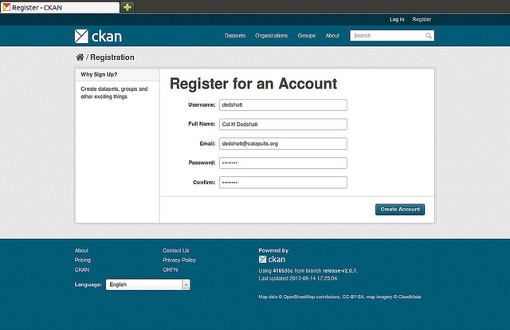

# Configure CKAN
This document describes how to configure your CKAN instance for your specific needs.


## Environment
Ubuntu 14.04 server

## Prerequisites

### 1. CKAN server installation
You need a running CKAN instance, of course. 
For installation, see the previous module on [installing CKAN](04-install-CKAN.md).

### 2. Internet connection and browser
Supported and tested browsers are:
1. Firefox, version 45 or later
2. Google Chrome, version 51 or later
Make sure that JavaScript is enabled.


## Configuration
In this tutorial, we focus on the basic basic settings. 
For further details, refer to the [CKAN documentation](http://docs.ckan.org/en/latest/maintaining/configuration.html)


### 1. The CKAN configuration file

The CKAN configuration file is located at `/etc/ckan/default/production.ini`.
You can, for instance, edit the *Front-end settings* according to your needs, for instance:

To illustrate how this works, we change the title of the portal entry page, the description, and the logo. 
For the latter, the corresponding picture has to be made available in the path where CKAN expects the images for the html pages to be: 
```sh
$ sudo cp img/fish-and-chips.jpg /usr/lib/ckan/default/src/ckan/ckan/public/base/images/
```

Now the settings in `production.ini` can be edited as follows: 
```sh
...
## Front-End Settings
ckan.site_title = Fish and Chips Repository
ckan.site_logo = /base/images/fish-and-chips.jpg
ckan.site_description = The great repository for research about fish, chips and other interesting science
...
```

To make the changes active, you have to restart the apache and the nginx server:
```sh
$ sudo service apache2 restart
$ sudo service nginx restart
```

**Excercise** 
Adapt the *Email settings* in `/etc/ckan/default/production.ini`.

### 2. Creating a sysadmin user for CKAN

Sometimes you need first to create a CKAN user, before you can make it to a system administrator. For this please register a user named 'ckan-admin' via the 'Register button as shown here :



To make this user to a 'sysadmin' use the `paster` command in an activated virtual environment and in your CKAN source directory:
```sh
$ . /usr/lib/ckan/default/bin/activate
(default)$ cd /usr/lib/ckan/default/src/ckan
(default)$ paster sysadmin add ckan-admin email=ckan-admin@localhost name=ckan-admin -c /etc/ckan/default/production.ini
User "ckan-admin" not found
Create new user: ckan-admin? [y/n]y
Password:
Confirm password:
Creating user: 'ckan-admin'
...
Added ckan-admin as sysadmin
```

Remember this username and password, you will need it in the next module!


