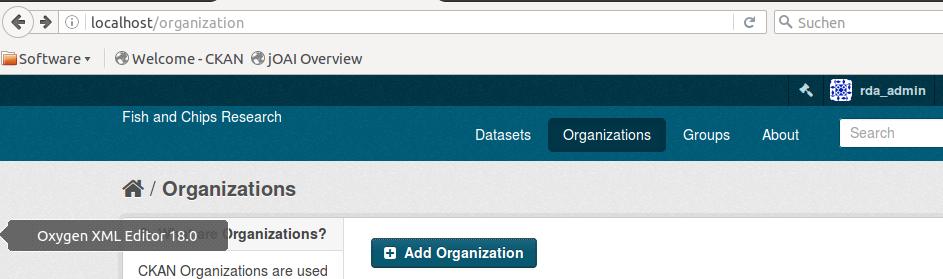
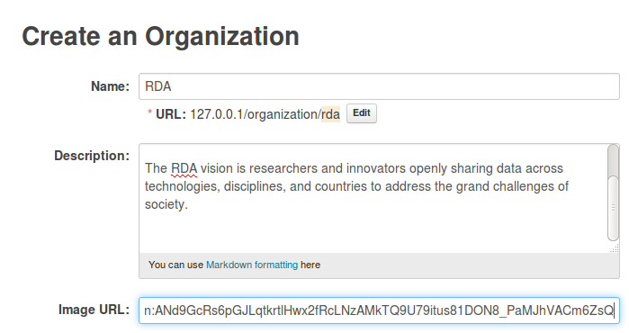
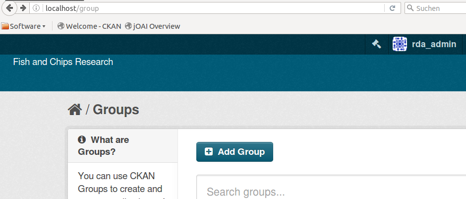
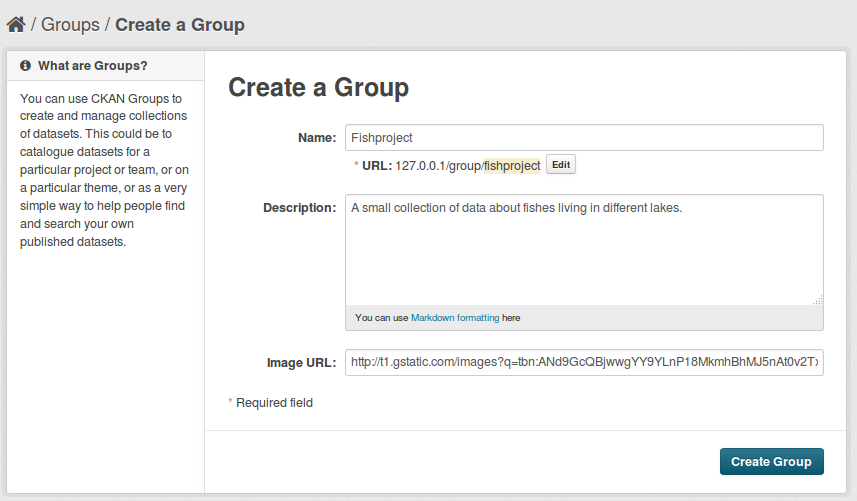
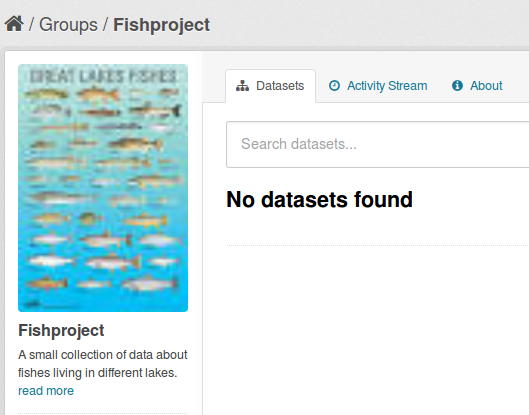
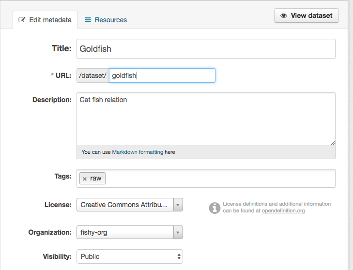
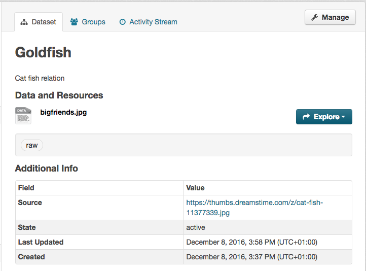

# Uploading to the metadata catalogue (CKAN portal)
This document describes how to upload metadata to your CKAN instance. 

## Environment
Ubuntu 14.04 server

##Prerequisites

### 1. CKAN server set up
* Of course you need a running CKAN instance. For installation see the previous module [Install CKAN](04-install-CKAN.md).
* CKAN manager account
 To be allowed to upload and update datasets in your CKAN instance you have first create a *CKAN sysadmin* account. How this is done is described in the previous module [CKAN configuration](04.a-configure-CKAN.md).

### 2. Internet connection and browser
Supported and tested are:
* Firefox, version 45 or later
* Google Chrome, version 51 or later

### 3. Spreadsheet template
For this part you can document in the tab **Mapping V n.m (YYMMDD)** in the excel spreadsheet **Community-B2FIND.template.xlsx** in the columns examples how the metadata are represented in the original community portal (as far it exists) and in your (or the B2FIND) portal. Typically at this stage a version for your community is created with the tabs **Harvest** and **Mapping** already filled out (by the B2FIND team and/or the community/project). 

### 4. The uploader software
For uploading we use again the python script ```sh mdmanger.py```, this time in the mode ```sh‘u’```. 

### 5. Some JSON samples
The uploader process expects that CKAN compatible and validated files are available in the directory `oaidata/<projectname>/<subset>/json`. This is the case if the associated [mapping](03.a-map-metadata.md) and [validation](03.b-validate-metadata.md) has been successfully excecuted.

## The Upload process

#### 1. Create a CKAN Organization
The CKAN group denotes the owner of the data.
Please add first a `CKAN Organization` named *rda* :

To do this you have to login as CKAN admin in the CKAN website by clicking on 'Login'.

Then go to 'Organizations' and click on 'Add organization'.
We enter `RDA` as organisation name and add a description.
> Note : We have to use here `RDA` as organisation name, because this is used and needed in the upload source code.
Additionally you can add a logo by providing a link to a picture.



Confirming by `Create Organization` results in :




#### 2. Create a CKAN group for your project/community  
To upload metadata for your project <ProjectName> we create a correspending group in your CKAN instance (i.e. community in the B2FIND case), to group all metadata of the project under one umbrella.

To do this you have to login as CKAN admin in the CKAN website by clicking on 'Login'.

Then go to 'Groups' and click on 'Add group'.


We enter `fishproject` as group name and add a description of the project.
> Note : The group name is internally changed by CKAN to lower case string.
> You should only take care that this string is the same as used in the harvest and mapping procedure in the previous modueles.
Additionally you can add a logo by providing a link to a picture.


Confirming by `Create Group` results in an empty CKAN group.


#### 3a. Manual upload of metadata to CKAN
You can use the graphical user interface of CKAN to create metadata and link it to an organization and a group.
Click on the tab *Datasets* and then on the button *Add Dataset*.
You are now asked to fill in some metadata.


In the next tab you can also add some data to the entry. Click on finish. 
To link the dataset to a specific group click on the dataset and open the tab *Groups*. Here you can choose under which groups the dataset shall appear.


**Exercise** Create some datasets. How can you add some real data to an entry? How can you link a dataset with some external data resource, e.g. another entry in a repository?

#### 3b. Uploading of JSON files as datasets with the mdmanager script

Before you can upload data to your CKAN instance you need an appropriate API-key.
While logged in as admin user, click on your admin name (top panel on the right). You will find your key in the left corner below your username.
You can either pass  your API key everytime you upload data with the option `--auth=<API key>` or you create a file `/home/<user>/.netrc`
and add the following line to the file:
```sh
<ip-address, fully qualified domain name>:8181	<API key>
```

Uploading is executed by using the option `--mode u` and additional to teh options used before the IP adress of the CKAN instance has to be specified with the option `-i`.

```sh
./mdmanager.py --mode u -c fishproject -s http://localhost:8181/oai/provider --mdsubset sample_1 --mdprefix oai_dc -i localhost 
```

#### 3. Check the uploaded files
If all worked fine you should now see the uploaded datasets under the group <ProjectName> in the CKAN website.
...
