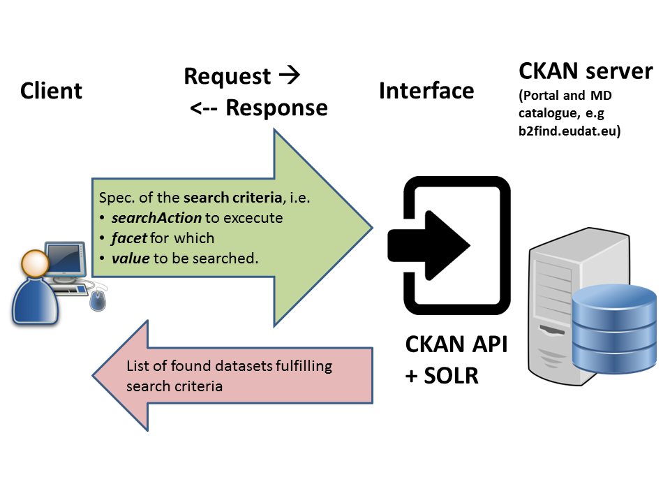
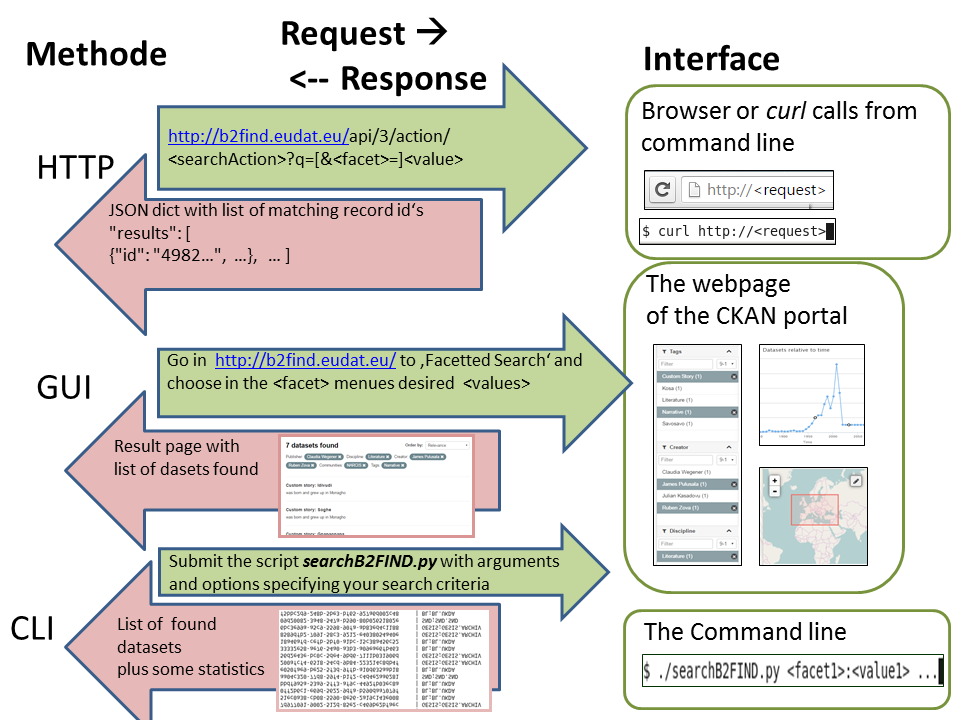

# Using B2FIND
This document describes how to use, i.e. browse, search and access data via B2FIND.

We refer here first to the online 'User Guide' at
https://eudat.eu/services/userdoc/b2find-usage

## Prerequisites

### 1. An internet browser 

with Java Script enabled. Supported and tested are

1. Firefox, version later than 45.x.y
2. Google Chrome, version later than 51.x.y

### 2. CKAN instance
Your own CKAN installation (see module *04-install-CKAN.md*) or access to the [B2FIND portal] (http://b2find.eudat.eu) (we are open !). Please reset in the following the variable <CKAN_URL> with the URL of the used CKAN site.

## Usage
The access onto a CKAN instance is based on the [CKAN API] (http://docs.ckan.org/en/latest/api/). The basic client-server communication is shown in the following figure :

You can use hereby different interfaces or methodes as listed below, described in detail in the related modules and as shown in the figure below :

1. *Direct HTTP* : Submit requests directly via http (`05.a-search-API.md`)
2. 'Graphical User Inteface' : Perform a 'Facetted Search' using the powerful functionality provided on the website of the portal (*05.b-search-GUI.md*)
3. *Command Line Interface* : Submit your search requests by specifying arguments and options of the provided script (*05.c-search-CLI.md*)

You find for all three 'methodes' detailed guides (see the files listed above), illustrated by several 'use cases of faceted search'.

Finally we explain in `05.d-data-access.md` how the underlying data collections can be accessed by the offered references in the metadata.

