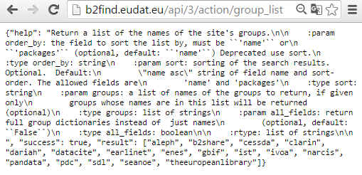

# B2FIND and the CKAN API

This document describes how you can interact with a CKAN site by directly submitting HTTP requests using the CKAN API, version 3. Both, the [05.b Search via the GUI](05.b-search-GUI.md) and the [05.c Command Line Interface](05.c-search-CLI.md)), are based on this API.

In this section, we show how requests can be submitted using three different methods:

1. *Browser* : Enter the HTTP requests directly in the address field of your internet browser
2. *cURL* : Submit the requests from the command line using `curl`
3. *Python ckanapi* : Submit the requests from a python shell using the python package `ckanapi`

For detailed instructions see below and the [CKAN API documentation](http://docs.ckan.org/en/latest/api/index.html).

## Prerequisites
Depending on which of the three methods you want to use, you need the tools described under points 1 to 3. Furthermore, a CKAN repository which you can access must be available, see point 4.
### 0. Internet connection
Your server must be able to make outgoing HTTP requests for this functionality.

### 1. Internet browser
Supported and tested browsers are:
1. Firefox, version 45 or later
2. Google Chrome, version 51 or later

### 2. Linux shell with cURL command
The `curl` command is used 'to transfer data from or to a server' and is provided by default with all common Linux distributions.

### 3. Python module ckanapi
A Python installation is required, preferably Python 2.7. The `ckanapi` package can be installed by one of the following commands:
```
pip install ckanapi
```
or
```
easy_install ckanapi
```

### 4. CKAN instance
To follow this tutorial you can submit search requests to:
- the [B2FIND portal](http://b2find.eudat.eu) (we are open!), or
- your own CKAN installation (see module [04. Install CKAN](./04-install-CKAN.md)), or
- any other CKAN site, e.g. the [CKAN Demo site](http://demo.ckan.org).

Note that some of the searches only make sense for the B2FIND portal, e.g. the facet 'Discipline' is only defined within the metadata schema of the B2FIND service. In the following, the `CKAN-URL` variable must be replaced by the URL of the used CKAN installation.

## Usage

### 1. Theory first : Submiting API Requests

The HTTP request `http-request`, directly using the [Action API](http://docs.ckan.org/en/latest/api/#action-api-reference) of CKAN, has the following form:

```sh
http://<CKAN_URL>/api/3/action/<action>
```
whereby `action` consists in
```sh
<function>[?q=<value>[&fq<facet>:<value>]]
```
with the partly optional parameters:

- `function` is one of the supported CKAN API functions. While some of these functions do not require parameters (e.g. `group_list`), the search commands, such as `package_search`, expect additional parameters: a value for both the attributes `q` and `facet` **and** a `value` for the attribute *fq*.
- `facet` is a field of the used schema (in case of B2FIND the B2FIND schema) and
- `value` is the corresponding value searched for.

Depending on the method you want to use, you can:

1. Enter the HTTP requests directly in the address field of your internet browser or
2. Submit the http requests from command line, using the command [cURL](http://man.cx/curl) by executing `curl <http-request>`. To transfer lengthy data as a JSON dictionary use the option `-d`. To display the response in a nicer formated JSON dictionary use piping the command in `| python -m json.tool` , as shown for the *Combined Search* at the end.
3. Use the Python package `ckanapi`: to connect to a CKAN end-point, e.g. to the B2FIND catalogue, issue the following commands in a Python shell:
```sh
$ python
> from ckanapi import RemoteCKAN
> ckan = RemoteCKAN("http://b2find.eudat.eu")
```

All searches are executed in a Python shell using the function *call_action*.

```sh
$ python
> ckan.call_action('<action>')
```

The data for the facetted search are specied in a dictionary, where the element `q` contains the value for the free text search and `fq` the facet-value pairs to be searched for, i.e.
```sh
> ckan.call_action('package_search',[{['q':'<value'>,]['fq':'<facet1>:<value1>' [ AND 'fq':'<facet2>:<value2> ]] ... }])
```

Note: combine several facet-value pairs by using the keyword `AND` in a single `fq` attribute value. Distributing multiple facet-value pairs in comma-separated `fq` occurences would not work properly, because only the last `fq` attribute value will be excecuted.

Other logical operators than *AND* are *OR* and *NOT*. By combining logical expressions you can create very powerful filters on the data.

If the query did not encounter an error, a submission returns as response a JSON dictionary with three keys:
- "help": the documentation string for the function you called.
- "success": true or false.
- "result": the returned result from the function you called, i.e. a list of (dictionaries describing) the records fulfilling the search criteria.

### 2. Some simple requests
To illustrate the usage of the CKAN API the following 'search use cases' are provided, whereby only the simple request `group_list` and a *combined search* is applied for each of the three methods. For all other facets only the associated `action` is provided. It is left as an exercise to you to apply the different query methods.

#### List communities (groups)

To list all CKAN groups use the action `groups_list`. For example, to get all *communities* (stored as CKAN groups) integrated in B2FIND do the following:



1. In a browser, enter the following address: [http://b2find.eudat.eu/api/3/action/group_list](http://b2find.eudat.eu/api/3/action/group_list). The corresponding request responds with a JSON dictionary, with the CKAN groups listed in the field `results`.

2. Do the same using *curl* in the command line:
```sh
$ curl http://b2find.eudat.eu/api/3/action/group_list | python -m json.tool
```
which should return the same standard output as above.
<!-- standard output removed
    "help": "Return a list of the names of the site's groups.\n\n    
    	  :param order_by: the field to sort the list by, must be ``'name'`` or\n      
    	  	``'packages'`` (optional, default: ``'name'``) Deprecated use sort.\n    
    	  :type order_by: string\n    
    	  :param sort: sorting of the search results.  Optional.  Default:\n       
    		 \"name asc\" string of field name and sort-order. The allowed fields are\n        
    	  	'name' and 'packages'\n    
    	  :type sort: string\n    
    	  :param groups: a list of names of the groups to return, if given only\n        
    	  	groups whose names are in this list will be returned (optional)\n    
    	  :type groups: list of strings\n    
    	  :param all_fields: return full group dictionaries instead of  just names\n 
    	  		(optional, default: ``False``)\n    
    	  :type all_fields: boolean\n\n    
    	  :rtype: list of strings\n\n    ",
    "result": [
        "aleph",
        "b2share",
        "cessda",
        "clarin",
        "dariah",
        "datacite",
        "earlinet",
        "enes",
        "gbif",
        "ist",
        "ivoa",
        "narcis",
        "pandata",
        "pdc",
        "sdl",
        "theeuropeanlibrary"
    ],
    "success": true
}
```
-->
3. Using the Python method the list groups are returned as list of unicode values:
```sh
$ python
>>> from ckanapi import RemoteCKAN
>>> ckan = RemoteCKAN("http://b2find.eudat.eu")
>>> ckan.call_action('group_list')
[u'aleph', u'b2share', u'cessda', u'clarin', u'dariah', u'datacite', 
u'earlinet', u'enes', u'gbif', u'ist', u'ivoa', u'narcis', u'pandata', 
u'pdc', u'sdl', u'seanoe', u'theeuropeanlibrary']
>>>
```

**Exercise 1**: List all CKAN groups available in other instances using each of the above methods.

**Exercise 2**: List all `tags` available in `b2find.eudat.eu` and other CKAN instances by using the function `tag_list` and one of the three methods (for B2FIND this results in a very long list, store the list appropriately). How many tags are there?

**Exercise 3**: List all datasets (packages). This command might take some time, depending on the extent of the CKAN instance used and the method applied to submit the request. How many could you find? Try the same for other CKAN sites.

### 3. Facetted search along a concrete use case

The function used for these kind of searches is *package_search*.

We explain the several facets you can search for in detail along a concrete use case:

> A scientist is interested in research data on polar coasts.
> She knows that the 'Polar Data Catalogue' offers access
> to this kind of data. Furthermore, she knows that her colleague Dustin published
> some interesting datasets about this topic in the past 26 years.
> In the first step, she restricts the search results on research concerning coasts
> to the 20th century. In the second step she, filters for studies on a particular
> coastal region at the northern boarder between Alaska and Canada.

In the following subsection we first explain how to search on single facets and move on to demonstrating the result of a full combined search, which will hopefully lead to the desired results our researcher needs for her own study.

#### Free text search
For free text search the attribute *q* is used with the value to search for.

Our scientist starts to search for datasets whose metadata body contains "coast", the associated `action` is ```package_search?q=coast```

Alternatively, take for the two arguments of `ckan.call_action` `package_search` and `{'q':'coast'}`.

Setting `CKAN_URL` to `b2find.eudat.eu` results in over 400 data sets. The lengthy output is not shown here.

**Exercise** Try the same for other CKAN sites and by using *curl* and the *python* shell.

#### Textual facets
For facetted search we use the attribute *fq* to assign a `value` to the `facet` should be searched for.

##### Community (or CKAN Group)
In B2FIND the facet `communities` corresponds to the CKAN facet `groups`.
The http request to filter all datasets belonging to the community `PDC` in the B2FIND catalogue is:

```sh
http://b2find.eudat.eu/api/3/action/package_search?fq=groups:pdc
```

#### Exercises

**Exercise 1**
Search in ```demo.ckan.org``` for all datesets belonging to the group with ID `governo`.

**Exercise 2**
Try to retrieve the `display_name` of the group with ID `governo`. (Hint : use the function `group_show`)

##### Discipline
Note: the following searches are dependent on the existence of the facet *Discipline*. While it is defined in the B2FIND schema it might not exist in your CKAN instance. Please use the `CKAN-URL` *b2find.eudat.eu* to complete the exercises below.

To filter e.g. for all B2FIND datasets assigned to the discipline `Environmental Science` enter:
```sh
http://b2find.eudat.eu/api/3/action/package_search?fq=Discipline:"Environmental Science"
```

Note: You have to use the quotes `"` to take the blank in `Environmental Science` into account.

##### Creator (or Author)
In B2FIND the facet *Creator* is mapped to the CKAN field *Author*. To filter e.g. for all datasets created by `Dustin Whalen` in the B2FIND repository enter:

```sh
http://b2find.eudat.eu/api/3/action/package_search?fq=author:Dustin?Whalen
```

Analogously, we can search for datasets in demo.ckan.org whose author is *Lagares* :

```sh
http://demo.ckan.org//api/3/action/package_search?fq=author:Lagares
```

#### Coverage
Sometimes you would like to filter for entries lying in a specific region or mentioning or being created in a specific periode of time. This information, however, is not part or not making sense for all metadata records.

To enable these facets describing coverage [CKAN extensions](https://github.com/ckan/ckan/wiki/List-of-extensions) needs to be installed. This is done for the B2FIND service, while the *CKAN demo site* offers only geospatial search.

##### Publication year
The feature to filter for publication year is developed by and implemented in B2FIND by the CKAN extension [ckanext-datesearch](https://github.com/EUDAT-B2FIND/ckanext-datesearch).

To search for all datasets which are published between the years 1990 and 2016 the intrinsic extra fields `ext_startdate` and `ext_enddate` are used as shown here:

```sh
curl http://b2find.eudat.eu/api/3/action/package_search -d '{  "fq":"PublicationYear:[1990 TO 2017]"}' | python -m json.tool
```

##### Temporal Coverage (*Filter by Time*)
The feature to filter for temporal coverage is implemented in B2FIND through the CKAN extension [ckanext-timeline](https://github.com/EUDAT-B2FIND/ckanext-timeline).

If you want to search for all datasets, which have an overlap with the 20th century, restrict the facets `TemporalCoverageBeginDate` and `TemporalCoverageEndDate` for the start and end time to according intervals, respectively :

```sh
curl http://b2find.eudat.eu/api/3/action/package_search -d '
   {"fq":"TemporalCoverageBeginDate:[1900* TO *]",
    "fq":"TemporalCoverageEndDate:[* TO 1999*]" }' |  python -m json.tool
```

##### Geospatial Coverage
The feature to filter for geospatial coverage is implemented in B2FIND through the adapted CKAN extension [ckanext-spatial](https://github.com/ckan/ckanext-spatial).

Imagine we want to filter all datasets with a spatial extent that overlaps with a small region around the coast line at the northern border between Alaska and Canada.

Here we need the latitude and longitude coordinates of this region and have to use the CKAN extra field `ext_bbox` as follows:

```sh
curl http://b2find.eudat.eu/api/3/action/package_search -d '
    { "extras":
	{ "ext_bbox" : "-141.0,69.5,-140.0,70.0" }
    }' | python -m json.tool
```

### Combined search
We now want to combine all the single search criteria to satisfy the use case of our researcher. In other words, we want to filter out all datasets that fulfill each of the following criteria within **one call** (we only list here the facets which working properly by directly sending combined HTTP CKAN API requests):

1. The word `coast` is found in the full text body of the metadata record
2. The data belongs to the community *PDC*
3. The data is 'created' by `Dustin Whalen`
4. The data is originated from the discipline 'Environmental Science'
5. The data are published between 1990 and 2016
6. The data cover the 20th century
7. The spatial extent has an intersection with a small section of the northern costal line at the border between Alaska and Canada.

This looks for the several methods as follows :

#### In your browser
Enter the following text in the address field:
```sh
http://b2find.eudat.eu/dataset?q=coast&groups=pdc&Discipline=Environmental+Science&author=Dustin+Whalen&PublicationYear:[1990 TO 2016]&TemporalCoverageBeginDate:[1900 TO *]&TemporalCoverageEndDate:[* TO 1999*]&ext_bbox=-141.7236328125,69.38031271734351,-140.1416015625,70.18510275498964
```

#### Using cURL
Issue the following command:
```sh
curl http://b2find.eudat.eu/api/3/action/package_search -d '
    { "q":"coast",
       "fq":"groups:pdc",
       "fq":"Discipline:Environmental?Science",
       "fq":"author:Dustin?Whalen",
       "fq":"TemporalCoverageBeginDate:[1900* TO *]",
       "fq":"TemporalCoverageEndDate:[* TO 1999*]",
       "extras": {
       	   "ext_bbox" : "-141.0,69.5,-140.0,70.0",
	   "ext_startdate" : "1990-01-01T00:00:00Z",
	   "ext_enddate" : "2016-12-31T23:59:59Z"
    }
}' | python -m json.tool
```

```
curl http://b2find.eudat.eu/api/3/action/package_search -d '
    { "q":"coast",
       "fq":"groups:pdc",
       "fq":"Discipline:Environmental?Science",
       "fq":"author:Dustin?Whalen",
       "fq":"PublicationYear:[1990 TO 2017]"
}' | python -m json.tool
```

#### Using the Python module `ckan-api`
Enter the following commands in a Python environment:
```sh
>>> response = ckan.call_action('package_search',{'q':'coast',
	"fq":"groups:pdc AND author:Dustin?Whalen", 
	"extras":{"ext_bbox" : "-141.0,69.5,-140.0,70.0", 
		"ext_startdate" : "1990-01-01T00:00:00Z",
		"ext_enddate" : "2016-12-31T23:59:59Z" }})
>>> print response["count"]
5
```

#### Exercises

**Exercise 1**: Play around with all three 'methods' and discuss in groups :
What are the pro's and con's, especially for such a lengthy and complex request ?

**Exercise 2**: Set up your own use cases and try to transpose them in CKAN requests. Docuemnt and discuss your experiences by submitting your requests.

## Some basic statistics

We have already used the key `count`, which returns the number of documents found. The key `sort` tells us how the documents are sorted in the output. The key `results` contains all entries found. We will have a look at them later. First, we would like to draw your attention to `facet` and `search_facet`.

These two fields are empty for our queries above. Let us inspect these two entries for the query below:

```python
response = ckan.call_action('package_search',{
    'fq':'Discipline:Linguistics',
    'facet.field':['author', 'Language'],
    'facet.limit':10
    })
```

We search for documents from the `Discipline` "linguistics" and we are interested in which `Languages` we find and which authors published the documents.

To do so, we give an extra parameter *facet.field* which is a python list and contains the names of two other facets `author` and `Discipline`. The `facet.limit` gives the number of the top hits (default = 1).

We see that most of the documents are published in *Dutch*, followed by *German* and that the most active authors are *Sotaro Kita* and *Amanda Brown*.

Note: the two facets in `facet.field` are not joint, i.e. the documents falling under *Dutch* do not necessarily have an author from the list of top 10 authors.

The result under
```python
response['search_facets']
```
gives us the same extra information namely `count`, `display_name` and `name`.

We can use these two fields to retrieve some statistics on our result.

### The documents output

Now we will inspect the `results` field of the response. From the value in
```python
response['sort']
```
we know that the most recent documents are on top of the list.
