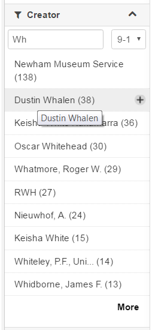

# The Search using the GUI of the B2FIND portal
This document describes the functionality of the graphical user interface (GUI) of B2FIND. For details see the [ user documentation ] (https://eudat.eu/services/userdoc/b2find-usage). 

##Prerequisites

### 1. An internet browser
with Java Script enabled. Supported and tested are

1. Firefox, version later than 45.x.y
2. Google Chrome, version later than 51.x.y

### 2. CKAN instance
Your own CKAN installation (see module *04-install-CKAN.md*) or access to the [B2FIND portal] (http://b2find.eudat.eu) (we are open !). Please reset in the following the variable <CKAN_URL> with the URL of the used CKAN site.

## Usage

### 1. Usage of the 'Facetted Search'
If you want to use your own CKAN installation, open please the according website <CKAN_URL>. In this case you can just use the search functionality which comes with the default CKAN installation. For this training tutorial we use the demo site (http://demo.ckan.org/) provided by CKAN.

If you want to use the [B2FIND metadata service] (http://b2find.eudat.eu), open please the website and enter the tab `Facetted Search`. 
In the navigation bar on the left hand side interfaces to powerful and easy-to-use search and filter functionality are offered.

You can choose for each facet in user-friendly widgets of popup menues values and excecute the according search request. This is further supported by filtering and sorting mechanisms.

A submission results in a `result page` on the right hand site with a list of the dataset found fulfilling the search criteria as shown in the following figure :

We illustrate this with the following 'search use cases', i.e. specific searches in the B2FIND catalogue for one of the facets listed in the B2FIND schema (see *03.a-map-metadata.md* ).

#### Example 1 : List communities (groups) integrated in B2FIND

Clicking on the tab `Communities` in the top of the website results a view of all the logos of the communities integrated in B2FIND are shown.

In default installations of CKAN you can instead use the tab 'Groups'.

#### Example 2 : Free text search

In the graphical user interface are free text fields provided where you can enter text for which will be searched in the full bodies of the metadata records. E.g. entering `coast` in the field results in the page shown in the figure above.

As well you can use this free text field to search for available textual facets as schown in the following.

#### Example 3 : Using the `textual` facets

##### Example 3.a : Filter out a community (or group)
For the sake of this example, we assume you want filter out all datasets of the B2FIND catalogue belonging to the community `PDC`. For this open the top-down menue of 'Communities' and choose the value `PDC` :

In case of a CKAN instance where the field 'Community' is not implemented as a searchable CKAN field, you can instead search for a CKAN group, e.g. in the CKAN demo site for the group 'Dados Governamentais' as shown in the following figure.

 
##### Example 3.b : Search for a discipline
The facet *Discipline* is only defined in the B2FIND schema and there is no related CKAN default field. 

Again we first display all available disciplines and shrink the resulting value list to all including 'Env'. Finally filter out all datasets belonging to a specific research field, in this example we choose `Environmental Science`. 

##### Example 3.c : Search for a Creator ( or Author)
In B2FIND the facet *Creator* corresponds to the CKAN default field *Author* and a full list of available names can be shown by clicking on the corresponding facet field in the navigation bar : 

To filter out e.g. all datasets created by `Dustin Whalen` we use first the autocomplete functionality by entering `Wh` in the according field 'Filter' to shrink the list over shown values to a managable number.

Finally we can select the desired name

and result in

In CKAN instances, which provide no graphical search interface for the facet `Author` or `Creator` , you can although use 'facetted search' by entering key value pairs in the free text field. E.g. the search in the CKAN demo instance for all datasets with an author with last name 'Haseeb' is shown in the following figure :

 
#### Example 4 : Coverage search
This means the to filter out data objects which cover a specific region or periode. This information is only for a part of the metadata records available or senseful.

For these facets describing coverage the additional implementation of *CKAN extensions* are needed, as done for the B2FIND service. Therefore we illustrate these features only using `b2find.eudat.eu`.

Note : There are some issues with the interaction of spatial and temporal search. Especially apply first the 'Filter by time' search before excecuting the 'Filter by location'.

##### Example 4.a : Temporal search
This is developed by and implemented in B2FIND through the CKAN extension [ckanext-timeline] (https://github.com/EUDAT-B2FIND/ckanext-timeline).

To search e.g. for all datasets which temporal extent has an overlap with the 20th century, click on the 'Filter by time' button to open the widget the 'Filter by time' chart. 

Now you can pre-select in the `Histogram` at the bottom roughly a periode overlapping the 20th century. This results in a graph showing `Number of datasets` over `Time` in the upper part of the chart. Here you can optioanlly further zoom in the time line by dragging the mouse cursor over a sub section and choose the periode in the time-line by holding the <Ctrl>-key and clicking with the left mouse key first on the start point and then on the end point, as shown in the figure above. 

By pressing the 'Apply' button the chart 'Filter by Time' will be closed and the values (in seconds since the calendar year 0) will be overtaken in the fileds `Start:` and `End:`. (By mouse over these fields the date and time is displayed in a human readable form.)

But note that the search request will not excecuted until the `loop` button in the very right upper corner 

of the website is hit.

##### Example 4.b : Publication year search
This is developed by and implemented in B2FIND by the CKAN extension [ckanext-datesearch] (https://github.com/EUDAT-B2FIND/ckanext-datesearch).

To search e.g. for all datasets which are published between the years 1990 and 2016 click in the year fields of the interface `Publication Year` and go to the appropriate decade widget to select the desired years.

##### Example 4.c : Geospatial search
This is implemented in B2FIND through the adapted CKAN extension [ckanext-spatial] (https://github.com/ckan/ckanext-spatial).

Imagine we want to filtert out all datasets their spatial extent has an overlap with a small region around the boarder line at the northern border between Alaska and Canada.

For this click on the 'Draw Rectangle' button in the top right of the world map widget of the 'Filter of Location' interface, then select the desired region by dragging the cursor over the related box in the world map and press finally the 'Apply' button.

##### Example 5 : Combined search

We want now combine all the single search criteria together by conducting several search requests sequentially.

I.e. for the example searches given above we search for all datasets that fulfill each of the following criteria :

1. The word `coast` is found in the full text body of the metadata record
2. The data belongs to the community *PDC*
3. The data is 'created' by `Dustin Whalen`
4. The data is origined from the discipline 'Environmental Science'
5. The temporal coverage has an overlap with the 20th century 
6. The data is published after 1990 and before 2016
7. The spatial extent has an intersection with a small section of the northern costal line at the border between Alaska and Canada 
   
The sequential excecution of all associated search requests will step by step reduce the set of `datasets found` and finally lead to the following result page :

Above the list of the dataset titles the choosen textual facets are shown. By clicking on the related crosses in the value fields each `faceted filtering` can be undone again.

In the navigation bar on the left the spatial and temporal extent is shown. You can reverse one ore multiple of these selections by pressing the `Clear` button in the asociated widget.   
