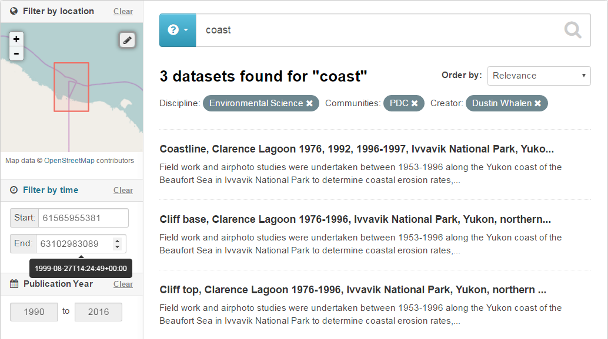

# Search using the Graphical User Interface (GUI) of the CKAN (B2FIND) portal
This document describes the functionality of the graphical user interface (GUI) of B2FIND.

For details on using this service, see the [User Documentation](https://eudat.eu/services/userdoc/b2find-usage).

## Prerequisites

### 1. Internet browser
with Java Script enabled. Supported and tested are

1. Firefox, version 45 or later
2. Google Chrome, version 51 or later

### 2. CKAN instance
Your own CKAN installation (see module [Install CKAN](./04-install-CKAN.md)) or access to the [B2FIND portal](http://b2find.eudat.eu) (we are open !).

Please replace the `CKAN-URL` variable with the URL of the used CKAN installation.

## Usage

### 1. Usage of the 'Facetted Search'
We will demonstrate the facetted search employed by the [B2FIND metadata service](http://b2find.eudat.eu). Please open the website and enter the tab `Facetted Search`.

If you want to use your own CKAN installation or the [CKAN demo](http://demo.ckan.org/), please open the respective website. In this case you can use the search functionality which comes with the default CKAN installation or those that have been installed in the demo version. That means that some queries we use here do not work.

When you open the facetted search in B2FIND or click on the *Datasets* tab in CKAN you will find a general query field on the top of the page and several preimplemented facets on the left-hand side.

Submission results are shown on the right hand site, by default, i.e. upon opening the page you will find a list of all datasets. If you enter `coast` in the field on top of that list you will see something like this:

In the following sections we illustrate the usage of the interface by inspecting several 'search use cases', i.e. specific searches in the B2FIND catalogue for the facets listed in the B2FIND schema (see [Map metadata](03.a-map-metadata.md)).

### 2. Some simple requests
We start with some simple list requests.

#### List Communities (groups)

Clicking on the tab `Communities` in the top of the website results a view of all the logos of the communities integrated in B2FIND are shown.

By clicking on one of these logos more detailed information about the community is shown.

In other installations of CKAN, as in the [CKAN demo site](http://demo.ckan.org), you can instead use the tab 'Groups'.

In the faceted search tab of B2FIND you can inspect tags and datasets in the same way.

#### Exercises

**Exercise: List tags (keywords)**
**Exercise: List all datasets (packages)**

### 3. Facetted search along a concrete Use Case
We explain the several facets you can search for in detail along a concrete use case.

> A scientist is interested in research data on polar coasts.
> She knows that the 'Polar Data Catalogue' offers access
> to this kind of data. Furthermore, she knows that her colleague Dustin published
> some interesting datasets about this topic in the past 26 years.
> In the first step she restricts the search result on research concerning coasts
> to the 20th century. In the second step she filters for studies on a particular
> coastal region at the northern boarder between Alaska and Canada.

In the following sub section we explain first how to search on single facets
and finally we provide the result of a full combined search, which leads hopefully to the desired
results our researcher needs for her own study.

#### Free text search

The graphical user interface provides a field for free text search (next to the questionmark). All records will be fetched that mention in their body somewhere the test you entered there. E.g. entering `coast` in the field results in the page shown in the figure above.

We will refine the free text search by adding free text to certain facets in the following sections.

#### Textual facets
In the navigation bar on the left search interfaces for the textual facets *Tags*, *Creator*, *Discipline*, *Language* and *Publisher* are offered. If you click on one of the facet fields a list of clickable values is displayed and a autocomplete field for filtering are opened.

##### `Community` (or `Group`)

For the sake of this example, we assume you want filter for datasets of the B2FIND catalogue belonging to the community `PDC`. Thus, we  open the top-down menue of 'Communities' and choose the value `PDC`.

In case of a CKAN instance where the field *Community* is not implemented as a searchable CKAN field, you can search for a CKAN group instead.

##### Discipline
The facet *Discipline* is only defined in the **B2FIND** schema and there is no related CKAN default field.

Again we first display all available disciplines and shrink the resulting value list to all including 'Env'. Finally, filter for all datasets belonging to a specific research field, in this example we choose `Environmental Science`.

##### Creator (or Author)
In B2FIND the facet `Creator` corresponds to the CKAN default field `Author` and a full list of available names can be shown again by clicking on the corresponding facet field in the navigation bar.

To filter all datasets created by 'Dustin Whalen' we use first the autocomplete functionality by entering 'Wh' in the corresponding field `Filter` to shrink the list over shown values to a manageable number.

Finally we can select the desired name:

and receive:

In CKAN instances, which provide no graphical search interface for the facet *Author* or *Creator*, you can still use facetted searches by **entering key value pairs in the free text field** as shown below:

#### Coverage
We would now like to filter data objects which cover a specific region or periode. This information is only available for a subset of the metadata records in B2FIND and CKAN.

For these facets describing coverage the additional implementation of [CKAN extensions](https://github.com/ckan/ckan/wiki/List-of-extensions) are needed, as done for the B2FIND service and at least the geospatial search as well for the CKAN demo site.

Note: there are some issues with the interaction of spatial and temporal search. Please, first apply the 'Filter by time' before applying the 'Filter by location'.

##### Publication year
This facet is developed and implemented in B2FIND by the CKAN extension [ckanext-datesearch](https://github.com/EUDAT-B2FIND/ckanext-datesearch).

To search e.g. for all datasets which are published in the period of 1990 to 2016 go to `Publication Year` and select the appropriate decade widget to select the desired years.

##### Temporal coverage (*Filter by Time*)
This facet is developed and implemented in B2FIND through the CKAN extension [ckanext-timeline](https://github.com/EUDAT-B2FIND/ckanext-timeline).

To search for all datasets whose temporal extent overlaps with the 20th century, click on the `Filter by time` button to open the widget chart.

Now, you can pre-select the time period at the bottom of the `Histogram` that overlaps with the 20th century. This results in a graph showing `Number of datasets` over `Time` in the upper part of the chart. Here you can also zoom into the time line by dragging the mouse cursor over a subsection and choose the periode in the time-line by holding the \<Ctrl\>-key and clicking with the left mouse key first on the start point and then on the end point, as shown in the figure above.

By pressing the `Apply` button the chart `Filter by Time` will be closed and the values (in seconds since the calendar year 0) will be shown in the fileds `Start:` and `End:`. (By hovering the mouse over these fields the date and time is displayed in a human readable form.)

Note, that the search request will not be excecuted until the `magnifier` button in the very right upper corner

of the website is hit.

##### Geospatial Coverage (Filter by Location)
This feature is implemented in B2FIND through the adapted CKAN extension [ckanext-spatial](https://github.com/ckan/ckanext-spatial).

Imagine we want to filter all datasets their spatial extent has an overlap with a small region around the coast line at the northern border between Alaska and Canada.

For this click on the 'Draw Rectangle' button in the top right of the world map widget of the 'Filter of Location' interface, then select the desired region by dragging the cursor over the related box in the world map and press finally the 'Apply' button.

#### Combined search
We now want to combine all these search criteria by conducting several search requests sequentially.

For the example searches given above we search for all datasets that fulfill each of the following criteria :

1. The word `coast` is found in the full text body of the metadata record
2. The data belongs to the community *PDC*
3. The data is *created* by `Dustin Whalen`
4. The data is origined from the discipline `Environmental Science`
5. The temporal coverage has an overlap with the `20th century`
6. The data is published after `1990` and before `2016`
7. The spatial extent has an intersection with a small section of the northern costal line at the border between Alaska and Canada

The sequential excecution of all associated search requests will step by step reduce the set of `datasets found` and finally lead to the following result page :

Above the list of the dataset titles the choosen textual facets are shown. By clicking on the related crosses in the value fields each `faceted filtering` can be undone again.

In the navigation bar on the left the spatial and temporal extent is shown. You can reverse one ore multiple of these selections by pressing the `Clear` button in the asociated widget.
