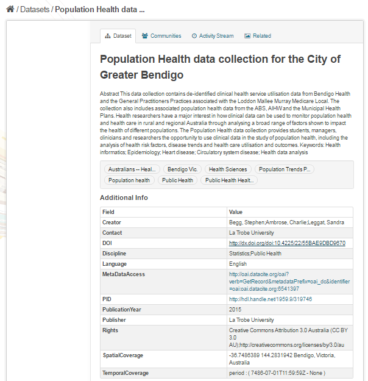
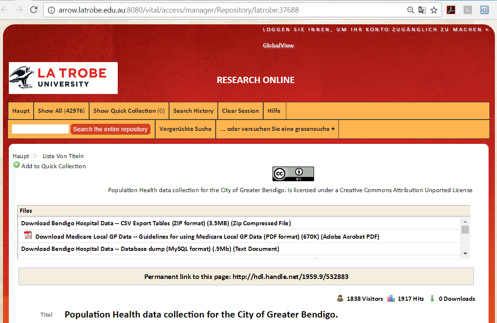
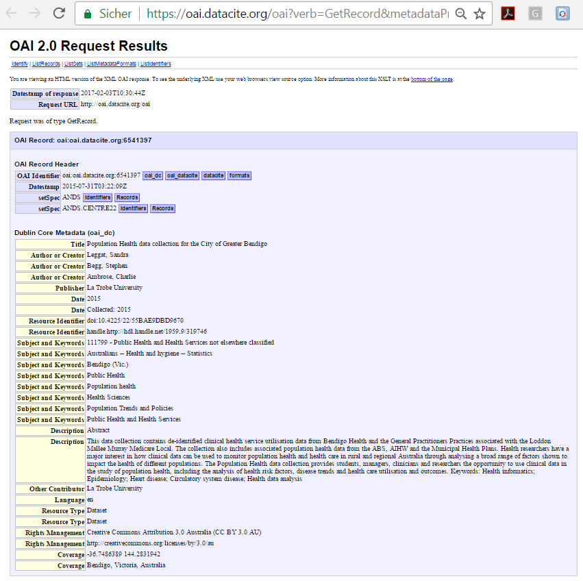

# Data Access
This document describes how to access data objects using the references in the metadata.

## Prerequisites

### 1. Internet browser
with Java Script enabled. Supported and tested are

1. Firefox, version 45 or later
2. Google Chrome, version 51 or later

### 2. CKAN instance
Only the usage of the data access identifiers given in [B2FIND portal](http://b2find.eudat.eu) are described.

## Usage

### 1. Usage of the references in B2FIND
We will demonstrate the ability to access data collections refered to by metadata, which are published in [B2FIND](http://b2find.eudat.eu). In case you use your own CKAN installation or the [CKAN demo site](http://demo.ckan.org), by default only the URL given by the CKAN field *Source* will be available).

When you open any dataset in the B2FIND portal at least one of the identifiers listed in the table below is available.

| Facet name | Type | Persistent | Resolvable | Citable |
|------------|------|------------|------------|---------|
| Source     | URL  | No         | ?          | No      |
| PID     | Persistent Identifier  | Yes         | Yes   | No |
| DOI     | Digital Object Identifier  | Yes         | Yes   | Yes |

- While the *Source* is linked directly to the *data resource*, it is not guaranteed that it really resolves to the associated digital data object.
- If a *PID* is given, it is assured that the link can be resolved, i.e. lead you to the data object. The resolving is done by handle servers.
- A *DOI* inherits these properties, but additionally it is mainly used to equip the related data object with a 'citation'. Therefore DOIs are often not directly redirected to the underlying resource, but a link to a landing page, for example a journal or a website of an institution that are responsible for the citation.

This is shown in the following figure:


### 2. A few examples

#### 2.a Dataset with *DOI* and *PID*
Let's investigate the dataset
```sh
http://b2find.eudat.eu/dataset/2bf94196-92bf-53a9-86fd-ec828671b757
```
which offers both, a DOI and a PID, as identifiers:



Clicking on the link provided for the field *PID* leads you directly to the institutional website from where you can download the associated data objects :



In this example the *DOI* leads to the same 'landing page' as the *PID*.

Furthermore you can display the original harvested metadata by following the link in the *MetaDataAccess* field. This is the response to the OAI GetRecord request the XML file is originally retrieved from the data provider, in this case the *DataCite* repository.



#### Exercise 1
Examine and analyze the following dataset samples:

```sh
http://b2find.eudat.eu/dataset/ebed26c5-0a26-52e9-8b33-0e3141c2c8eb
```

and answer the following questions :
- Which resource identifiers are offered?
- Are they different by value or not?
- Do they lead you to different (landing) pages?
- If it's a landing page: can you identify the data provider from this web site? Compare to the corresponding *Community* and *Publisher*
- Describe how far the underlying data object(s) can be directly accessed or not
- What is needed for fully access of the data collection? Compare this with the statements in the field *Rights*.
- Display the original metadata record
