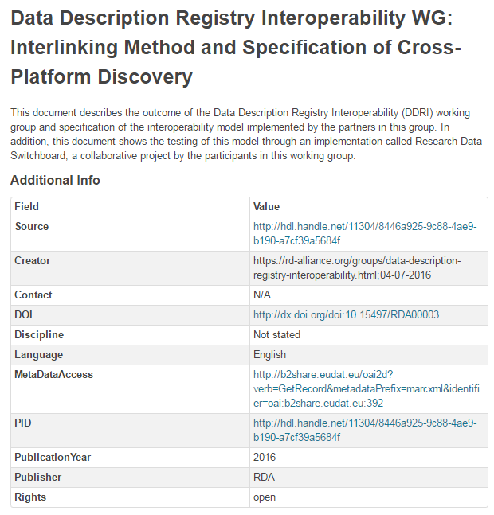

# Data Access 
This document describes how to access data objects using the references in the metadata

##Prerequisites

### 1. Internet browser
with Java Script enabled. Supported and tested are

1. Firefox, version later than 45.x.y
2. Google Chrome, version later than 51.x.y

### 2. CKAN instance
We only describe here the usage of the data access identifiers given in [B2FIND portal] (http://b2find.eudat.eu).

## Usage

### 1. Usage of the references in B2FIND
We will demonstrate the ability to access data collections refered to by metadata, which are published in [B2FIND](http://b2find.eudat.eu)
( In case you use your own CKAN installation or the [CKAN demo](http://demo.ckan.org/) by default only the URL given by the CKAN field *Source* will be availbale).

When you open any dataset in the B2FIND portal *at least one* of the identifiers listed in the table below is available.

| Facet name | Type | Persistent | Resolvable | Citable |
|------------|------|------------|------------|---------|
| Source     | URL  | No         | ?          | No      |
| PID     | Persistent Identifier  | Yes         | Yes   | No |
| DOI     | Digital Object Identifier  | Yes         | Yes   | Yes |

- While the *Source* is linked directly to the *data resource*, it is not guranteed that it resolves realy to the associated digital data object.
- If a *PID* is given, it is ashured that the link can be resolved, i.e. lead you to the data object. The resolvement is done by handle servers.
- A *DOI* heritates these properties, but additionaly it is mainly used to equip the related data object with a 'citation'. Therefore DOI's are often not directly redirected to the underlying resource, but link to a landing page, e.g. a journal or a website of an institution, which are responibsle for the citation. 

This is shown in the following figure :


### 2. A few examples

#### 2.a Dataset with *DOI*,*PID* and *Source*
Let's investigate the dataset
```sh
http://b2find.eudat.eu/dataset/e9165ebb-508b-53fb-8d88-1d998a91e3be
```
which offers all three kinds of identifiers :



Clicking on the link provided for the field *Source* leads you directly to the resource, in this case to the sub page of the DDRI working group of the RDA :


The given *PID* and *DOI* lead here to the same 'landing page', namely the dataset as it is shown in *B2SHARE* :


Furthermore you can display the original harvested metadata by following the lin in *MetaDataAccess* (actualy this is the response to the OAI GetRecord request the XML file is originally retrieved from the data provider, ihn this case the *B2SHARE* repository.


 
#### Exercise 1 : 
Examine and analyse the following datset samples :

```sh
http://b2find.eudat.eu/dataset/5e00001b-258c-5cde-82f7-56828f96e96b
```

and answer the following questions :
- Which resource identifiers are offered ?
- Are they different by value or not ?
- Do they lead you to different (landing) pages ?
- If it's a landing page : Can you identify the data provider from this web site? Compare to the associated *Community* and *Publisher*
- Describe how far the underlying data object(s) can be directly accessed or not? 
- What is needed for fully access of the data collection ? Compare this with thestatements in teh field *Rights*.
- Let display the original metadata record
  


