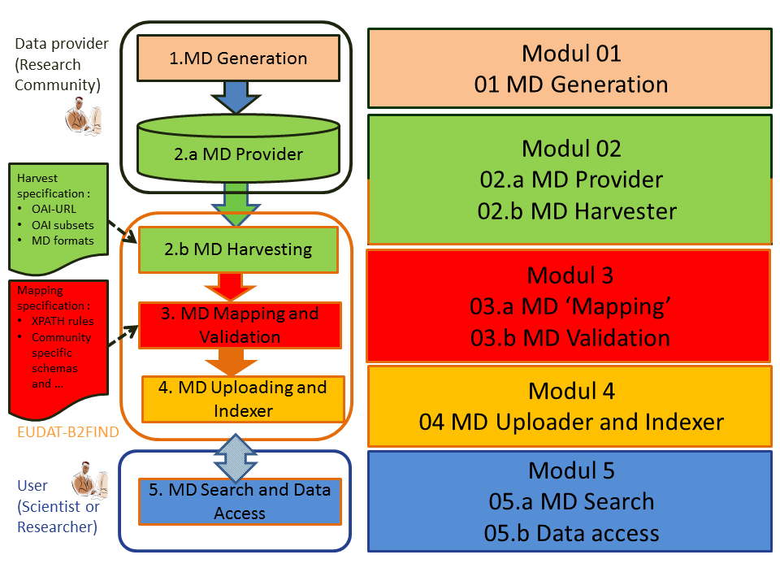

**`UNDER CONSTRUCTION`** **`This training material is under construction, please use with care`** **`UNDER CONSTRUCTION`**

# B2FIND-Training

## Content

This training module provides detailed instructions for integration in and usage of the [ EUDAT metadata service B2FIND ](http:/b2find.eudat.eu). Please consult the user [documentation on the services](https://eudat.eu/services/userdoc) for more general introduction in B2FIND.

Additionally we provide hands-on material for the whole metadata management workflow from metadata generation and formating, over providing and harvesting (using OAI-PMH ), to mapping and validation and finally uploading to a metadata catalogue and portal (based on CKAN). This workflow is shown together with the training modules in the figure below.

We provide step by step installation instructions which indocate how the training services and tools are setup and which will give the users an idea how to install the software stack temselves. 

## Target audience

This training material foresees three types of trainees: 
* those who want to learn how to **integrate** the B2FIND service, i.e. data managers who want to publish their metadata within EUDAT,
* those who want to **set up the whole metadata workflow**, including an OAI harvester service and an own CKAN portal, locally at their site. This may be geared more to data manageres and site admins. 
* those who want to **use** the EUDAT B2FIND service, i.e. scientists who want to search and access research data.

Following the full, in-depth tutorial will allow you to understand how the components of the whole metadata management workflow are combined and thus enables you to also extend the integration of the service B2FIND at the low-level (technology-level rather than API level). Following just the "use" part of the training will familiarise you with the query and search APIs of the services, but not with the underlying technology and its wiring.

## Submodules

The order and numbering of the submodules in the table below follows the curriculum of the training as shown in the figure above. Beside the *Target audience* we assign in the column *Required for B2FIND* mainly if a submodule is needed w.r.t. B2FIND usage or integration. Each component takes about 0.5 to 1.0 hours.

#    | Submodule            | Target audience           | Required for B2FIND
-----|--------------------------|---------------------------|-------------------
01.a | [Generate metadata](01.a-generate-metadata.md)| researchers/data managers | Not necessarily
01.b | [Specify metadata](01.b-specify-metadata.md)  | researchers/data managers | B2FIND integration 
02 | [Install the jOAI software ](02-install-jOAI.md) | site admins | B2FIND integration 
02.a | [Configure your data provider](02.a-configure-OAI-data_provider.md) | site admins | B2FIND integration
02.b | [Configure your harvester](02.b-configure-OAI-harvester.md) | site admins | Not needed for B2FIND integration
03.a | [Map metadata](03.a-map-metadata.md) | data managers and researchers | B2FIND integration
03.b | [Validate metadata](03.b-validate-metadata.md) | data managers and researchers | B2FIND integration
04 | [Install CKAN](04-install-CKAN.md) | site admins | B2FIND integration (availbale portal b2find.eudat.eu)
04.a | [Configure CKAN](04.a-configure-CKAN.md) | data managers | B2FIND integration (already done for b2find.eudat.eu)
04.b | Upload metadata(04.b-upload-metadata.md) | B2FIND integration, to b2find.eudat.eu done by B2FIND team)
05 | [Using B2FIND](05-using-B2FIND.md)	| researchers | B2FIND usage
05.a | [Graphical User Interface](05.a-search-GUI.md)	| researchers | B2FIND usage
05.b | [Command Line Interface](05.b-search-CLI.md)	| researchers | B2FIND usage
05.c | [Data access](05.c-data-access.md) |  researchers | B2FIND usage

<!-- LATER ON, 
The tutorial will show the functionality of single components and how to combine them in order to arrive at proper metadata management. 
If you follow all steps of the training course you will aim in an infrastrucre as shown in the scheme below.

-->

<!-- TODO !!!
### Users - Training
Users can get access to a setup of virtual machines (VMs) like above. 

Users can either choose to set up their personal computer to resemble the user interface machine or they can receive a login on a user interface VM on the training sandbox operated by the EUDAT User Documentation and Training Material team. Via the user interface machine they can access the first VM which contains an OAI-PMH server and a CKAN server. The user interface VM also provides the necessary python libraries to work with the meatadata *mapping* and *validation* and a command line tool to access B2FIND.

To get access to the training environment, please use the [EUDAT contact pages](https://eudat.eu/support-request?service=DOCUMENTATION); and provide some details on which community you are from and in which context you would like to follow the tutorial. 
-->
<!--
### Site admins - Training
Data managers and site admins will be guided through all steps to set up the environment, covering own OAI-PMH (jOAI) and CKAN installation, and python sources for *generating*, *mapping*, *validating* and *uploading* of metadata records. Furthermore all needed steps needed to publish your metadata in B2FIND are described.

To build the setup you will need to prepare or have access to at least one (potentially virtualised) computational resource; with e.g. 2 vCPU, 8GB memory, 20GB disk; running a Linux operating system (Ubuntu preferred); in which you have sudo rights.
-->
<!-- ##TODO 
If you want to follow a training remotely and need access to preinstalled machines contact #TODO
-->
