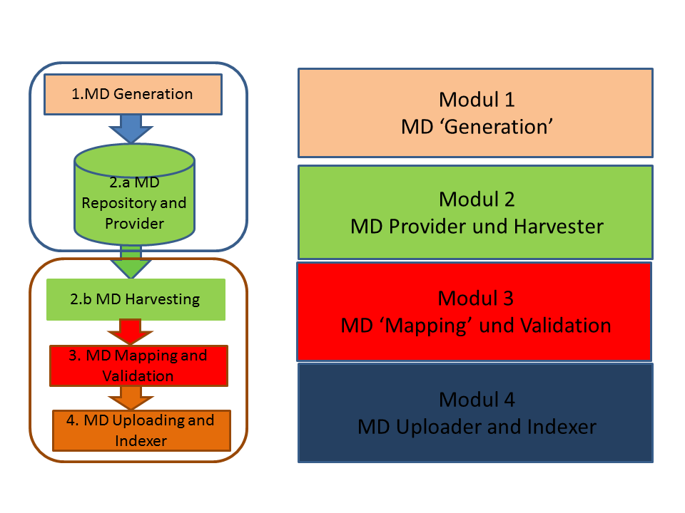
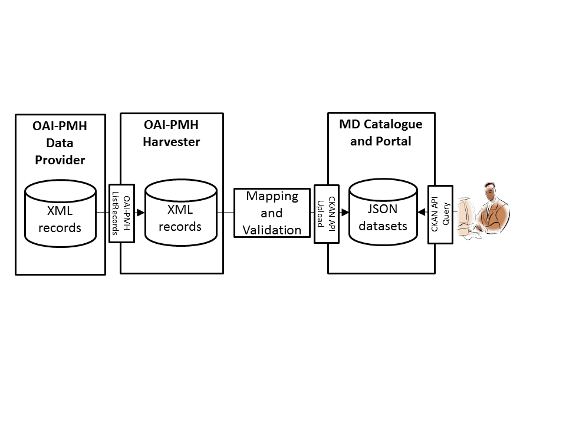

# B2FIND-Training

This training module comprises detailed instructions about integration in and usage of the EUDAT metadata service *B2FIND* (version 2.0).

Furthermore we provide hands-on material for the whole metadata management workflow from metadata generation and formating, over providing and harvesting (using OAI-PMH ), to mapping and validation and finally uploading to a metadata catalogue and portal (based on CKAN). 

Please consult the user [documentation on the services](https://eudat.eu/services/userdoc) for a general introduction, if needed, before following the contents of this git repository.

We provide step by step installation instructions which indocate how the training services and tools are setup and which will give the users an idea how to install the software stack temselves. 

This training material foresees two types of trainees: those who want to learn how to **integrate** the B2FIND service, i.e. data managers who want to publish their metadata within EUDAT, and those who want to **use** the EUDAT B2FIND service, i.e. scientists who want to search and access research data. Following the full, in-depth tutorial will allow you to understand how the components of the wholw metadata management workflow are combined and thus enables you to also extend the integration of the service B2FIND at the low-level (technology-level rather than API level). Following just the "use" part of the training will familiarise you with the query and search APIs of the services, but not with the underlying technology and its wiring.

The order of the markdown files proposes the curriculum of the training. Each component takes about 0.5 to 1.0 hours.

File | Target audience
------|-------------------
00-install-jOAI.md | site admins
01-configure-OAI-data_provider.md | site admins
02-configure-OAI-harvester.md | site admins
03-generate-metadata.md	| researchers and data managers
04-map_validate-metadata.md	| data managers and researchers
05-integration-B2FIND.md	| data managers and site admins
06-using-B2FIND.md	| researchers

## Setup
During the tutorial site admins learn how to set up an infrastructure like indicated in the picture below. 
<!--
Users can make use of a pre-deployed instance of this infratructure on the EUDAT Training Sandbox. 
-->

<!-- TODO !!!
### Users - Training
Users can get access to a setup of virtual machines (VMs) like above. 
-->
The tutorial will show the functionality of single components and how to combine them in order to arrive at proper metadata management. 
<!--
Users can either choose to set up their personal computer to resemble the user interface machine or they can receive a login on a user interface VM on the training sandbox operated by the EUDAT User Documentation and Training Material team. Via the user interface machine they can access the first VM which contains an OAI-PMH server and a CKAN server. The user interface VM also provides the necessary python libraries to work with the meatadata *mapping* and *validation* and a command line tool to access B2FIND.

To get access to the training environment, please use the [EUDAT contact pages](https://eudat.eu/support-request?service=DOCUMENTATION); and provide some details on which community you are from and in which context you would like to follow the tutorial. 
-->

The appropriate parts of the tutorial you can follow in the training environment are labeled with "researchers" and "data managers" in the table above.

### Site admins - Training
Data managers and site admins will be guided through all steps to set up the environment, covering own OAI-PMH (jOAI) and CKAN installation, and python sources for *generating*, *mapping*, *validating* and *uploading* of metadata records. Furthermore all needed steps needed to publish your metadata in B2FIND are described.

To build the setup you will need to prepare or have access to at least one (potentially virtualised) computational resource; with e.g. 2 vCPU, 8GB memory, 20GB disk; running a Linux operating system (Ubuntu preferred); in which you have sudo rights.

<!--
##TODO If you want to follow a training remotely and need access to preinstalled machines contact #TODO
-->